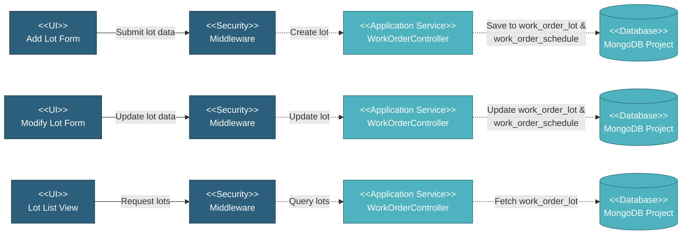

# 5.4.5 Lot Management

This component manages production lots for work orders, enabling lot-based tracking for manufacturing, coating, inspection, and delivery processes. Each lot represents a batch of items with specific quantities and schedules.

---

## Component Design Diagram

*Figure: Lot Management Component Design*

---

## 5.4.5.1 User Interface

### 5.4.5.1.1 Add Lot Form

Form for creating new lots with quantity and schedule information. Different forms for different processes:
- **Production**: ProductionAddLotFormComponent
- **Coating**: CoatingAddLotFormComponent
- **Document Submission**: DocSubmissionLotFormComponent

### 5.4.5.1.2 Modify Lot Form

Form for updating existing lot quantities and schedules. Separate modify forms for each process type matching the add forms.

### 5.4.5.1.3 Lot List View

Displays all lots for a work order with quantities, schedules, and progress. Shows lot-based progress tracking and allows lot management operations.

---

## 5.4.5.2 Security

**Write Operations** (`project.wo:W`):
- Create lot: `createLot()`
- Delete lot: `deleteLot()`

**Read Operations** (`project.wo:R`):
- View lot list: `lotFilterWO()`, `lotFilterSOW()`
- Get lot options for dropdowns

---

## 5.4.5.3 Application Services

### 5.4.5.3.1 Create/Update Lot

`WorkOrderController::createLot()` - Creates new or updates existing production lot.

**Process**:
1. Validate input: qty, qty_unit, base_schedule_date, forecast_schedule_date
2. Create `work_order_lot` record with id_wo reference
3. Generate or update `work_order_schedule` records for each schedule type (production, inspection, coating, etc.)
4. Set initial progress values if creating new lot (qty_real = 0, percent_real = 0)
5. Return success response

### 5.4.5.3.2 Delete Lot

`WorkOrderController::deleteLot()` - Removes lot and associated schedules if no progress made yet.

**Process**:
1. Find lot by ID
2. Delete associated `work_order_schedule` records
3. Delete `work_order_lot` record
4. Recalculate work order total progress
5. Return success response

## 5.4.5.4 Database

**Project Database** (`mongodb_project_{project_code}`):

- **`work_order_lot`** - Lot records: id_wo, qty, qty_unit, base_schedule_date, forecast_schedule_date, created_at
- **`work_order_schedule`** - Schedule per lot: id_wo_lot, schedule (production/inspection/coating/etc.), qty, qty_real, percent_real, base/forecast/actual dates, status
- **`work_order`** - Referenced by lots for total quantity validation

---
