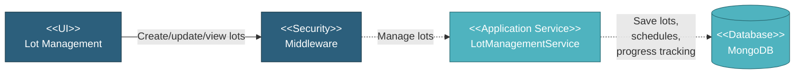

# 5.4.5 Lot Management

This component manages production lots for work orders, enabling lot-based tracking for manufacturing, coating, inspection, and delivery processes. Each lot represents a batch of items with specific quantities and schedules.

---

## Component Design Diagram

```mermaid
graph LR
    UI_LOT["&lt;&lt;UI&gt;&gt;<br/>Lot Management"]
    SEC["&lt;&lt;Security&gt;&gt;<br/>Middleware"]
    LOT_SVC["&lt;&lt;Application Service&gt;&gt;<br/>LotManagementService"]
    DB[("&lt;&lt;Database&gt;&gt;<br/>MongoDB")]

    UI_LOT -->|Create/update/view lots| SEC
    SEC -.->|Manage lots| LOT_SVC
    LOT_SVC -.->|Save lots,<br/>schedules,<br/>progress tracking| DB

    style UI_LOT fill:#2C5F7C,stroke:#1a3a4a,color:#fff
    style SEC fill:#2C5F7C,stroke:#1a3a4a,color:#fff
    style LOT_SVC fill:#4FB3BF,stroke:#2a6d76,color:#fff
    style DB fill:#4FB3BF,stroke:#2a6d76,color:#fff
```

*Figure: Lot Management Component Design*

---

## 5.4.5.1 User Interface

### 5.4.5.1.1 Add Lot Form

Form for creating new lots with quantity and schedule information. Different forms for different processes:
- **Production**: ProductionAddLotFormComponent
- **Coating**: CoatingAddLotFormComponent
- **Document Submission**: DocSubmissionLotFormComponent

### 5.4.5.1.2 Modify Lot Form

Form for updating existing lot quantities and schedules. Separate modify forms for each process type matching the add forms.

### 5.4.5.1.3 Lot List View

Displays all lots for a work order with quantities, schedules, and progress. Shows lot-based progress tracking and allows lot management operations.

---

## 5.4.5.2 Security

Middleware validates the authentication token sent from the Lot Management UI. Only authenticated and authorized users can proceed to create or view lots.

**Security Checks:**
- `auth:api` - Validates JWT token via Laravel Passport
- `project.session:api` - Validates user has access to the project database
- `user.privileges` - Checks for `project.wo:W` privilege to create/edit lots, or `project.wo:R` to view lots

---

## 5.4.5.3 Application Services

### 5.4.5.3.1 Lot Creation and Management

Enables users to divide work orders into manageable production batches (lots) for better tracking and scheduling. Users specify lot quantity and schedule dates, and the system creates the lot record, generates schedule entries for each production stage (production, inspection, coating, etc.), initializes progress tracking for the lot (starting at 0%), and links the lot to the parent work order. This enables lot-based progress tracking where each lot can have different schedules and progress independently.

### 5.4.5.3.2 Lot Modification

Allows updating lot quantities and schedules when production plans change. Users can adjust lot quantities, update base and forecast schedule dates, and modify lot configurations. The system validates changes against work order totals, updates all related schedule entries, and recalculates progress percentages based on new quantities. This flexibility supports dynamic production planning.

### 5.4.5.3.3 Lot Deletion

Supports removal of lots that haven't started production yet. The system validates that no progress has been recorded for the lot, deletes all associated schedule entries, removes the lot record, and recalculates work order total progress. This prevents deletion of lots with recorded progress, maintaining data integrity and historical accuracy.

## 5.4.5.4 Database

**Project Database** (`mongodb_project_{project_code}`):

- **`work_order_lot`** - Lot records: id_wo, qty, qty_unit, base_schedule_date, forecast_schedule_date, created_at
- **`work_order_schedule`** - Schedule per lot: id_wo_lot, schedule (production/inspection/coating/etc.), qty, qty_real, percent_real, base/forecast/actual dates, status
- **`work_order`** - Referenced by lots for total quantity validation

---
