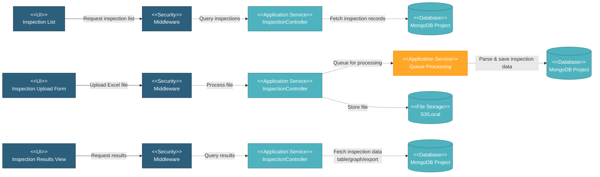

# 5.4.6 Inspection

This component manages inspection data uploads, processing, and reporting for work orders. Supports various inspection types (hydrostatic, dimensional, etc.) with Excel file uploads with template download and column mapping, data validation, and automated report generation.

---

## Component Design Diagram

*Figure: Inspection Component Design*

---

## 5.4.6.1 User Interface

### 5.4.6.1.1 Inspection Upload Form

Form for uploading inspection data files. Supports multiple inspection types:
- **Excel Upload**: Dimensional inspection, visual inspection, hardness test, impact test, tensile test, etc. with template download and mapping validation
- **PDF Upload**: Hydrostatic test, HSD test - direct PDF upload

### 5.4.6.1.2 Inspection List

DataTables view showing all inspection uploads with status, test type, upload date, and processing queue status.

### 5.4.6.1.3 Inspection Results View

Interface for viewing inspection results with multiple formats:
- **Table View**: Detailed inspection data in tabular format with export to Excel
- **Graph View**: Visual charts for inspection results (histograms, control charts)
- **PDF Download**: Download uploaded PDF files for hydrostatic/HSD tests
- **Mapping Reports**: Custom report templates with field mapping

---

## 5.4.6.2 Security

**Write Operations** (`project.wo:W`):
- Upload inspection: `create()`
- Delete inspection: `delete()`
- Delete inspection: `deleteQueue()`
- Save mapping report: `saveMappingReport()`
- Create inspection mapping: `createInspectionMapping()`

**Read Operations** (`project.wo:R`):
- View inspection list: `datatables()`, `datatables_technical()`
- Get inspection detail: `read()`
- Download queue file: `downloadQueueFile()`
- Get queue detail & status: `getQueue()`, `getQueueStatus()`
- View reports: `getReportTable()`, `getReportMappingTable()`, `getMappingPDFReport()`
- Get table/graph data: `getTable()`, `getGraph()`
- Download template: `downloadTemplate()`
- Export inspection result to excel: `export()`

---

## 5.4.6.3 Application Services

### 5.4.6.3.1 Upload Inspection

`InspectionController::create()` - Uploads and queues inspection file for processing.

**Process**:
1. Validate Excel file format and column mapping
2. Store file to S3/local storage
3. Create queue record with status "pending"
4. Dispatch background job to parse Excel and save inspection data
5. Return queue ID and status

### 5.4.6.3.2 Process Inspection Queue

Background job processes queued inspection files.

**Process**:
1. Read Excel file from storage
2. Validate data against specification requirements
3. Parse inspection values (dimensions, test results, etc.)
4. Save to `testing_table` (detailed test data) and `testing` (metadata) collections with pipe/heat number/material ID references
5. Update `queue_file` status to "completed" or "failed"
6. Generate inspection summary statistics

### 5.4.6.3.3 View Inspection Data

`InspectionController::datatables()` and `read()` - Retrieve inspection records.

**Process**:
1. Query `testing` and `testing_table` collections filtered by work order/SOW
2. Include test type, stage, upload date, queue status from `queue_file`
3. For detail view: fetch all test values and metadata
4. Return formatted data with file report links (if applicable especially for hydrostatic and HSD tests)

### 5.4.6.3.4 View Inspection Results

`InspectionController::getReportTable()`, `getGraph()`, `getMappingPDFReport()`, `export()` - View inspection results in different formats.

**Process**:
1. Query `testing_table` data by filters (work order, test type, date range)
2. For table view: format data with success/fail indicators, support Excel export via `export()`
3. For graph view: aggregate data for charts (histograms, scatter)
4. For mapping reports: apply custom field mapping template from `inspection_mapping`
5. Return formatted data or file download

### 5.4.6.3.5 Inspection Mapping

`InspectionController::createInspectionMapping()` and `getMappingAttributes()` - Manage templates column mapping.

**Process**:
1. Define field mappings between inspection data and report template
2. Save mapping configuration to `inspection_mapping` collection
3. Apply mapping when extracting data from Excel file
4. Support multiple mapping templates per test type

---

## 5.4.6.4 Database

**Project Database** (`mongodb_project_{project_code}`):

- **`testing_table`** - Testing data records: id_wo, id_sow, test_type, stage, pipe_no, heat_no, test_values (array), pass_fail_status, upload_date, id_queue
- **`testing`** - Testing metadata: id_wo, test_type, stage, upload_date, id_queue, status
- **`queue_file`** - Upload queue: file_path, test_type, status (pending/processing/completed/failed), error_message, created_at
- **`inspection_mapping`** - Mapping templates: test_type, data (array), id_item, id_spec, created_by
- **`work_order`** - Referenced for testing requirements
- **`specification`** - Referenced for testing criteria and limits

**File Storage** (S3/Local):

- Inspection Excel files and uploaded PDF report (hydrostatic, HSD tests)

---
