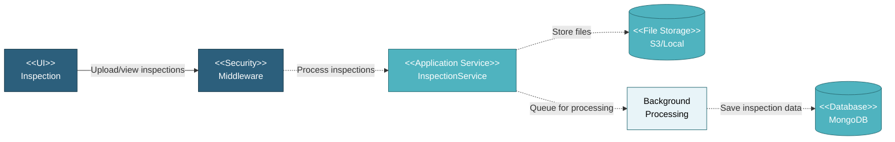

# 5.4.6 Inspection

This component manages inspection data uploads, processing, and reporting for work orders. Supports various inspection types (hydrostatic, dimensional, etc.) with Excel file uploads with template download and column mapping, data validation, and automated report generation.

---

## Component Design Diagram

```mermaid
graph LR
    UI_INSP["&lt;&lt;UI&gt;&gt;<br/>Inspection"]
    SEC["&lt;&lt;Security&gt;&gt;<br/>Middleware"]
    INSP_SVC["&lt;&lt;Application Service&gt;&gt;<br/>InspectionService"]
    DB[("&lt;&lt;Database&gt;&gt;<br/>MongoDB")]
    STORAGE[("&lt;&lt;File Storage&gt;&gt;<br/>S3/Local")]
    QUEUE["Background<br/>Processing"]

    UI_INSP -->|Upload/view inspections| SEC
    SEC -.->|Process inspections| INSP_SVC
    INSP_SVC -.->|Store files| STORAGE
    INSP_SVC -.->|Queue for processing| QUEUE
    QUEUE -.->|Save inspection data| DB

    style UI_INSP fill:#2C5F7C,stroke:#1a3a4a,color:#fff
    style SEC fill:#2C5F7C,stroke:#1a3a4a,color:#fff
    style INSP_SVC fill:#4FB3BF,stroke:#2a6d76,color:#fff
    style DB fill:#4FB3BF,stroke:#2a6d76,color:#fff
    style STORAGE fill:#4FB3BF,stroke:#2a6d76,color:#fff
    style QUEUE fill:#E8F4F8,stroke:#2a6d76,color:#000
```

*Figure: Inspection Component Design*

---

## 5.4.6.1 User Interface

### 5.4.6.1.1 Inspection Upload Form

Form for uploading inspection data files. Supports multiple inspection types:
- **Excel Upload**: Dimensional inspection, visual inspection, hardness test, impact test, tensile test, etc. with template download and mapping validation
- **PDF Upload**: Hydrostatic test, HSD test - direct PDF upload

### 5.4.6.1.2 Inspection List

DataTables view showing all inspection uploads with status, test type, upload date, and processing queue status.

### 5.4.6.1.3 Inspection Results View

Interface for viewing inspection results with multiple formats:
- **Table View**: Detailed inspection data in tabular format with export to Excel
- **Graph View**: Visual charts for inspection results (histograms, control charts)
- **PDF Download**: Download uploaded PDF files for hydrostatic/HSD tests
- **Mapping Reports**: Custom report templates with field mapping

---

## 5.4.6.2 Security

Middleware validates the authentication token sent from the Inspection UI. Only authenticated and authorized users can proceed to upload or view inspection data.

**Security Checks:**
- `auth:api` - Validates JWT token via Laravel Passport
- `project.session:api` - Validates user has access to the project database
- `user.privileges` - Checks for `project.wo:W` privilege to upload/edit inspections, or `project.wo:R` to view inspection data

---

## 5.4.6.3 Application Services

### 5.4.6.3.1 Inspection File Upload

Supports uploading inspection data files in multiple formats. For Excel files (dimensional inspection, visual inspection, hardness test, impact test, tensile test), users upload files with column mapping validation against templates. For PDF files (hydrostatic test, HSD test), users upload reports directly. The system stores files to file storage, queues Excel files for background processing, and provides immediate confirmation with queue status. Template downloads are available to ensure correct file format.

### 5.4.6.3.2 Background Processing

Processes uploaded Excel files asynchronously to avoid blocking user operations. The system reads the Excel file from storage, validates data against specification requirements, parses inspection values (dimensions, test results, pass/fail status), saves detailed test data with pipe/heat number references, updates queue status to completed or failed, and generates inspection summary statistics. This ensures large inspection files don't impact system performance.

### 5.4.6.3.3 Inspection Results Viewing

Provides multiple views for inspection data analysis. Table view displays detailed inspection data with pass/fail indicators and supports Excel export. Graph view shows visual charts (histograms, control charts) for trend analysis. PDF download retrieves uploaded hydrostatic and HSD test reports. Custom mapping reports apply field mapping templates for specific report formats. This enables project teams to analyze inspection results effectively.

### 5.4.6.3.4 Inspection Mapping Management

Allows configuration of custom field mappings between inspection data and report templates. Users define how Excel columns map to inspection fields, save mapping configurations per test type, and apply mappings during file processing. This supports different vendor formats and ensures consistent data extraction across various inspection file formats.

---

## 5.4.6.4 Database

**Project Database** (`mongodb_project_{project_code}`):

- **`testing_table`** - Testing data records: id_wo, id_sow, test_type, stage, pipe_no, heat_no, test_values (array), pass_fail_status, upload_date, id_queue
- **`testing`** - Testing metadata: id_wo, test_type, stage, upload_date, id_queue, status
- **`queue_file`** - Upload queue: file_path, test_type, status (pending/processing/completed/failed), error_message, created_at
- **`inspection_mapping`** - Mapping templates: test_type, data (array), id_item, id_spec, created_by
- **`work_order`** - Referenced for testing requirements
- **`specification`** - Referenced for testing criteria and limits

**File Storage** (S3/Local):

- Inspection Excel files and uploaded PDF report (hydrostatic, HSD tests)

---
