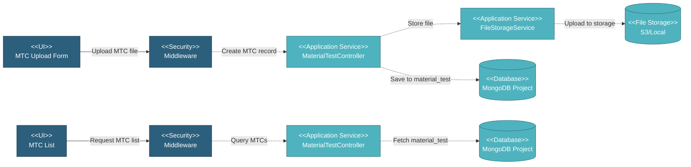

# 5.4.7 Material Test Certificates

This component manages material test certificate (MTC) uploads and tracking for work orders. MTCs document material properties, chemical composition, and mechanical test results from manufacturers.

---

## Component Design Diagram

*Figure: Material Test Certificates Component Design*

---

## 5.4.7.1 User Interface

### 5.4.7.1.1 MTC Upload Form

Form for uploading material test certificate files. Requires:
- **Material Name**: Name of the material being tested
- **Batch Numbers**: Multiple batch numbers can be added (array)
- **Status**: Material test status
- **Attachment**: MTC file (PDF/image)

Supports add and edit modes with duplicate batch number validation.

### 5.4.7.1.2 MTC List

DataTables view showing all MTCs with material name, batch numbers (comma-separated), status, and file name. Supports download, edit, and delete operations.

---

## 5.4.7.2 Security

**Write Operations** (`project.wo:W`):
- Upload MTC: `create()`
- Delete MTC: `delete()`

**Read Operations** (`project.wo:R`):
- View MTC list: `datatables()`
- Get MTC detail: `read()`
- Download MTC file: `download()`
- Check duplicate batch: `checkDuplicate()`

---

## 5.4.7.3 Application Services

### 5.4.7.3.1 Upload/Update MTC

`MaterialTestController::create()` - Creates or updates MTC record with file upload.

**Process**:
1. Validate input: material_name, batches (array), status, attachment file, id_wo
2. Check for duplicate batch numbers via `checkDuplicate()`
3. Upload MTC file to S3/local storage
4. Save to `material_test` collection with material_name, batches array, status, file path
5. Return success response

### 5.4.7.3.2 View MTCs

`MaterialTestController::datatables()` and `read()` - Retrieve MTC records.

**Process**:
1. Query `material_test` filtered by work order
2. Include material_name, batches (array), status, file name, upload date
3. For detail view: fetch complete MTC data with file download link
4. Return formatted data for DataTables

### 5.4.7.3.3 Download MTC

`MaterialTestController::download()` - Downloads MTC file.

**Process**:
1. Find MTC record by ID
2. Retrieve file from S3/local storage
3. Return file download response with original filename

### 5.4.7.3.4 Delete MTC

`MaterialTestController::delete()` - Removes MTC record and file.

**Process**:
1. Find MTC record by ID
2. Delete file from S3/local storage
3. Delete `material_test` record
4. Return success response

### 5.4.7.3.5 Check Duplicate

`MaterialTestController::checkDuplicate()` - Validates batch number uniqueness.

**Process**:
1. Query `material_test` for existing batch numbers in batches array
2. Filter by work order
3. Return duplicate status (true/false)

---

## 5.4.7.4 Database

**Project Database** (`mongodb_project_{project_code}`):

- **`material_test`** - MTC records: id_wo, material_name, batches (array), status, attachment (file_path, file_name), upload_date, created_by
- **`work_order`** - Referenced for MTC requirements

**File Storage** (S3/Local):

- Material test certificate files (PDF, images)

---
