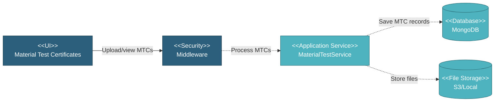

# 5.4.7 Material Test Certificates

This component manages material test certificate (MTC) uploads and tracking for work orders. MTCs document material properties, chemical composition, and mechanical test results from manufacturers.

---

## Component Design Diagram

```mermaid
graph LR
    UI_MTC["&lt;&lt;UI&gt;&gt;<br/>Material Test Certificates"]
    SEC["&lt;&lt;Security&gt;&gt;<br/>Middleware"]
    MTC_SVC["&lt;&lt;Application Service&gt;&gt;<br/>MaterialTestService"]
    DB[("&lt;&lt;Database&gt;&gt;<br/>MongoDB")]
    STORAGE[("&lt;&lt;File Storage&gt;&gt;<br/>S3/Local")]

    UI_MTC -->|Upload/view MTCs| SEC
    SEC -.->|Process MTCs| MTC_SVC
    MTC_SVC -.->|Save MTC records| DB
    MTC_SVC -.->|Store files| STORAGE

    style UI_MTC fill:#2C5F7C,stroke:#1a3a4a,color:#fff
    style SEC fill:#2C5F7C,stroke:#1a3a4a,color:#fff
    style MTC_SVC fill:#4FB3BF,stroke:#2a6d76,color:#fff
    style DB fill:#4FB3BF,stroke:#2a6d76,color:#fff
    style STORAGE fill:#4FB3BF,stroke:#2a6d76,color:#fff
```

*Figure: Material Test Certificates Component Design*

---

## 5.4.7.1 User Interface

### 5.4.7.1.1 MTC Upload Form

Form for uploading material test certificate files. Requires:
- **Material Name**: Name of the material being tested
- **Batch Numbers**: Multiple batch numbers can be added (array)
- **Status**: Material test status
- **Attachment**: MTC file (PDF/image)

Supports add and edit modes with duplicate batch number validation.

### 5.4.7.1.2 MTC List

DataTables view showing all MTCs with material name, batch numbers (comma-separated), status, and file name. Supports download, edit, and delete operations.

---

## 5.4.7.2 Security

Middleware validates the authentication token sent from the Material Test Certificates UI. Only authenticated and authorized users can proceed to upload or view MTCs.

**Security Checks:**
- `auth:api` - Validates JWT token via Laravel Passport
- `project.session:api` - Validates user has access to the project database
- `user.privileges` - Checks for `project.wo:W` privilege to upload/edit MTCs, or `project.wo:R` to view MTC data

---

## 5.4.7.3 Application Services

### 5.4.7.3.1 MTC Upload and Management

Allows users to upload material test certificates documenting material properties, chemical composition, and mechanical test results from manufacturers. Users enter material name, batch numbers (multiple batches supported), and test status, then attach the MTC file (PDF or image). The system validates batch number uniqueness to prevent duplicates, uploads the file to storage, saves the MTC record with batch references, and makes the certificate immediately available for viewing and download. This ensures all material certifications are properly documented and traceable.

### 5.4.7.3.2 MTC Viewing and Download

Displays all MTCs for a work order in a searchable list showing material name, batch numbers, status, and upload date. Supports downloading MTC files for review and verification. Enables project teams to quickly access material certifications and verify compliance with specifications. Batch numbers are displayed as comma-separated values for easy reference.

### 5.4.7.3.3 MTC Editing and Deletion

Supports updating MTC records when corrections are needed or additional batches are added. Allows deletion of MTC records and associated files when certificates are uploaded incorrectly. Validates batch number uniqueness during edits to maintain data integrity. This flexibility ensures MTC records remain accurate and up-to-date.

---

## 5.4.7.4 Database

**Project Database** (`mongodb_project_{project_code}`):

- **`material_test`** - MTC records: id_wo, material_name, batches (array), status, attachment (file_path, file_name), upload_date, created_by
- **`work_order`** - Referenced for MTC requirements

**File Storage** (S3/Local):

- Material test certificate files (PDF, images)

---
