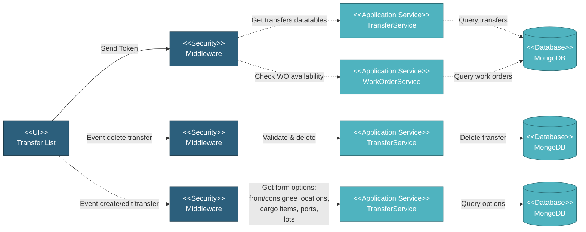

# 5.5.1 Transfer List Page

## 5.5.1.1 Overview

The Transfer List page displays all transfers in a datatable with expandable rows showing cargo details. Users can create new transfers, edit existing ones, view route details, and track vessels.

## 5.5.1.2 User Interface

The Transfer List displays transfers in a datatable with the following columns: From (origin location), Consignee (destination), ETD (Estimated Time of Departure), ETA (Estimated Time of Arrival), Transportation Type (Plane, Sea, Train, etc), Route (location icon for route details), Remark (info icon if remarks exist), Status (Scheduled/In Progress/Completed), and Actions (Edit/Delete/Expand buttons). Each row can be expanded to show cargo details including item description, specification, coating information (if applicable), quantity, related SOW, location (if applicable), and cargo detail button. The Create Transfer button is disabled if no work orders are available. Users can click the location icon to view route details with vessel tracking, click the info icon to view transfer remarks, edit transfers (disabled for completed transfers unless dates are editable), delete transfers with confirmation, and expand rows to view associated cargos.

## 5.5.1.3 Security

Middleware validates the authentication token sent from the Transfer List UI. Only authenticated and authorized users can proceed to view and manage transfers.

**Security Checks:**
- `auth:api` - Validates JWT token via Laravel Passport
- `project.session:api` - Validates user has access to the project database
- `user.privileges:project.transfer,R` - Read permission to view transfers
- `user.privileges:project.transfer,W` - Write permission to create/edit/delete transfers

## 5.5.1.4 Application Services

### 5.5.1.4.1 Get Transfers Datatables

**TransferService**: Retrieves paginated transfer records for the datatable including transfer ID, from location name, consignee name, ETD and ETA dates, transportation type (Plane, Sea, Train, etc), route information, remarks, status (scheduled/in_progress/completed), associated cargos with item details, and edit permissions based on status. Returns data formatted for datatable display with expandable cargo rows.

### 5.5.1.4.2 Check Work Order Availability

**WorkOrderService**: Checks if any work orders exist in the project to enable/disable the Create Transfer button. Returns boolean indicating if work orders are available.

### 5.5.1.4.3 Delete Transfer

**TransferService**: Deletes a transfer record and all associated cargo data. Validates transfer exists and user has permission. Removes transfer, routes, and cargo records from database. Returns success status.

### 5.5.1.4.4 Get Transfer for Edit

**TransferService**: Retrieves transfer data for editing including transfer details, from and consignee information, cargo list with items and quantities, route information, and current status. Returns transfer data formatted for edit form.

## 5.5.1.5 Database

Transfer data is stored and retrieved from MongoDB:

**Project Database:**
• **transfer** - Transfer records with from/to locations, dates, type, and status
• **cargo** - Cargo records associated with transfers
• **work_order** - Work order records to check availability
• **sow** - SOW records for cargo relationships