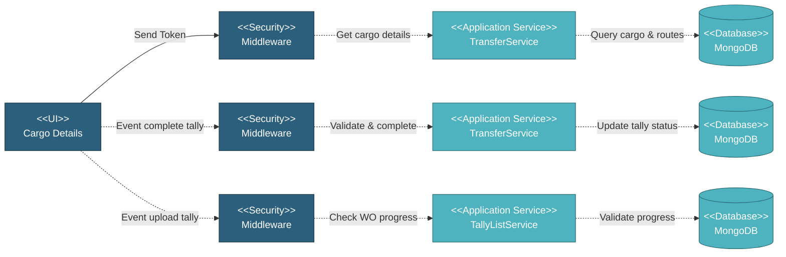

# 5.5.2 Cargo Details Page

## 5.5.2.1 Overview

The Cargo Details page displays detailed information about a specific cargo including transfer routes, tally operations, and load/unload tracking. The page adapts its layout based on whether the cargo is a customer pickup or standard transfer.

## 5.5.2.2 User Interface

The Cargo Details page displays cargo information in a header section showing item description, specification, coating type and spec (if applicable), quantity with unit, related SOW, and customer pickup indicator. Below the header, the page shows route information in a table-like format. For standard transfers, it displays Load Out and Load In columns with port names, ETD/ETA dates, vessel information, tally file dropdowns, "Tally Completed" buttons (when not completed), and "View Tally" buttons to see tally details. For customer pickup transfers, it displays only Load Out information with simplified columns. Users can upload tally sheets for each route leg, mark tally as completed when all items are tallied, view detailed tally information including pipe details, download tally attachments, and track completion status per route.

## 5.5.2.3 Security

Middleware validates the authentication token sent from the Cargo Details UI. Only authenticated and authorized users can proceed to view and manage cargo details.

**Security Checks:**
- `auth:api` - Validates JWT token via Laravel Passport
- `project.session:api` - Validates user has access to the project database
- `user.privileges:project.transfer,R` - Read permission to view cargo details
- `user.privileges:project.transfer,W` - Write permission to manage tally operations

## 5.5.2.4 Application Services

### 5.5.2.4.1 Get Cargo Details

**TransferService**: Retrieves detailed cargo information including cargo ID, item description and type, specification details, coating information (if applicable), quantity and unit, related SOW information, customer pickup flag, route information with load out/in details, tally files per route, completion status per route, and vessel information. Returns cargo data with all associated route and tally information.

### 5.5.2.4.2 Check Work Order Progress

**TallyListService**: Validates if work order progress is sufficient to allow tally upload for load out operations. Checks if work order has completed items ready for transfer. Returns validation status and error message if not ready.

### 5.5.2.4.3 Check Complete Tally Quantity

**TransferService**: Validates if all required items have been tallied before marking as complete. Compares tallied quantity against expected cargo quantity. Returns validation status and any discrepancies.

### 5.5.2.4.4 Complete Tally

**TransferService**: Marks a route's tally as completed after validation. Updates route completion status, sets completion timestamp, locks tally from further edits, and updates transfer overall status if all routes complete. Returns success status.

## 5.5.2.5 Database

Cargo and tally data is stored and retrieved from MongoDB:

**Project Database:**
• **cargo** - Cargo records with item details and quantities
• **transfer** - Transfer records for cargo relationships
• **route** - Route records for load out/in information
• **tally_file** - Tally sheet uploads and metadata
• **work_order** - Work order records for progress validation
• **sow** - SOW records for cargo relationships
