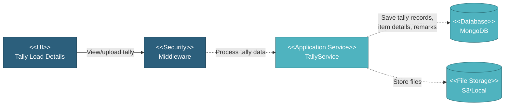

# 5.5.4 Tally Load Details Page

The Tally Load Details page displays detailed tally information for a specific route leg (Load Out or Load In). The page has two tabs: "Tally Uploaded" showing uploaded tally files, and "Item Details" showing individual pipe/item details with remarks and attachments.

---

## Component Design Diagram

*Figure: Tally Load Details Component Design*

---

## 5.5.4.1 User Interface

The page displays a header table with route information including port/yard, ETD/ETA (or ATD/ATA if confirmed), transport type, vessel name, MMSI ID, activity (Load Out/Load In), quantity with progress percentage, and an "Add Tally" button to upload new tally sheets.

Below the header are two tabs:

**Tally Uploaded Tab:**
- Displays uploaded tally files in a datatable
- Columns: Upload Date, Load Out/In Date, PCS in Tally, Tally (file name with download link), Delete button
- Shows "Tally Completed" button at the bottom (disabled if no tally files uploaded)

**Item Details Tab:**
- Displays individual pipe/item details in a datatable
- Columns vary by item type but typically include: Item No., Mill Control No., Heat No., Plate No. (or equivalent), Length, New Length, Weight, Issue, Status, Remark, Attachments, and action buttons
- For Bends: Mother Item No., Mill Control No., Heat No., Item No. (Bend)
- For BA Combi: Pup Item No., Centre Item No., Mill Control No., Heat No., Item No.
- Users can add/edit remarks with attachments and download cutting documents

## 5.5.4.2 Application Services

### 5.5.4.2.1 Get Route Detail

**TransferService**: Retrieves detailed route information including route ID and type (load_out/load_in), cargo information, port and vessel details, ETD/ETA dates, list of tallied items with pipe details, issue/damage status, remarks and attachments, and completion status. Returns route data with all tally information.

### 5.5.4.2.2 Get Tally Options

**TransferService**: Retrieves options for tally operations including available pipe issues, pipe missing reasons, and tally sheet mapping configurations. Returns options for tally form dropdowns.

### 5.5.4.2.3 Edit Tally Remark

**TransferService**: Updates remarks and attachments for a specific tallied item. Accepts remark text, issue type, old/new length values, and file attachments. Uploads new attachments to storage, updates remark record in database, and returns success status.

## 5.5.4.3 Database

**Project Database:**
• **route** - Route records with tally information
• **tally_file** - Tally sheet uploads and pipe details
• **tally_data** - Individual pipe tally records with issue/damage status
• **attachment** - File attachments for remarks
