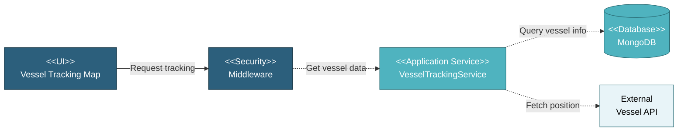

# 5.5.5 Vessel Tracking

The Vessel Tracking feature displays real-time or historical vessel location on a map with route visualization. This is accessible from the Transfer List page by clicking the location icon for transfers with vessel information.

---

## Component Design Diagram

*Figure: Vessel Tracking Component Design*

---

## 5.5.5.1 User Interface

The vessel tracking modal displays a Google Maps interface showing the vessel's current or last known position marked with a ship icon, the complete route path from origin to destination, port markers for load out and load in locations, and vessel information including name, IMO number, and last update timestamp. The map automatically centers and zooms to show the entire route. Users can pan and zoom the map, click markers for port/vessel information, and see the vessel's movement history along the route.

## 5.5.5.2 Application Services

### 5.5.5.2.1 Get Tracking Details

**TransferService**: Retrieves vessel tracking information by querying vessel tracking API or database including vessel current position (latitude/longitude), vessel details (name, IMO, type), route waypoints from origin to destination, port coordinates for load out/in, last position update timestamp, and estimated arrival time. Returns tracking data formatted for map display.

## 5.5.5.3 Database

**Project Database:**
• **transfer** - Transfer records with vessel information
• **transfer_route** - Route records with port coordinates
• **vessel_tracking** - Historical vessel position data
• **locodes** - Port location coordinates
