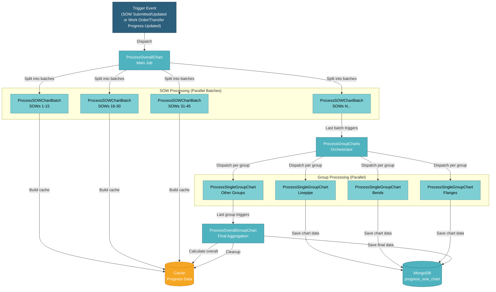

# 5.6.1 Progress Chart Generation

Progress Chart Generation is a critical background process that calculates and stores historical progress data for S-curve charts. This process runs asynchronously using job chaining to handle large datasets efficiently and prevent performance issues.



## 5.6.1.1 Overview

The chart generation process is triggered whenever SOW data or any progress data changes (submission, updates, or work order/transfer progress updates). Instead of processing everything synchronously, the system uses a job chaining architecture that:

1. **Breaks down work into batches** - SOWs are processed in batches of 15 to prevent memory issues
2. **Processes groups in parallel** - Each item type (Linepipe, Bends, etc.) is processed independently
3. **Aggregates at the end** - Overall group is calculated last after all individual groups complete
4. **Uses caching** - Progress calculations are cached to avoid N+1 query problems

## 5.6.1.2 Job Chain Architecture

### 5.6.1.2.1 ProcessOverallChart (Entry Point)

This is the main job that initiates the entire chart generation process. When triggered by SOW submission or progress updates, it calls the `saveOverallChartStatsWithJobChaining()` method to begin the job chain. The job sets up a job locker using cache key `overall_chart_locker_{db_name}` to indicate generation is in progress and prevent duplicate runs. It then splits all completed SOWs into batches of 15 and dispatches `ProcessSOWChartBatch` jobs for parallel processing.

### 5.6.1.2.2 ProcessSOWChartBatch (Parallel Batches)

Each batch processes up to 15 SOWs (configurable) to generate per-SOW chart data. When a batch job starts, it receives an array of SOW IDs and calls `processSowBatch()` for each SOW to generate both monthly and daily chart data. The job uses `buildProgressCache()` to pre-calculate progress stats and avoid repeated database queries. As batches complete, they track progress using an atomic counter in cache. The last batch to complete triggers the next stage by dispatching `ProcessGroupCharts`. To prevent race conditions, an atomic lock (`{counter_key}_dispatch_lock`) ensures only one batch triggers the next stage.

### 5.6.1.2.3 ProcessGroupCharts (Orchestrator)

This orchestrator job coordinates the processing of all item type groups. It retrieves the list of groups to process (Linepipe, Bends, Flanges, and other item types configured in the project) and dispatches a `ProcessSingleGroupChart` job for each group except 'overall'. The 'overall' group is excluded at this stage because it must be processed last to aggregate data from all individual groups. As groups complete, an atomic counter tracks progress, and the last group to complete triggers `ProcessOverallGroupChart`.

### 5.6.1.2.4 ProcessSingleGroupChart (Parallel Groups)

Each group job generates chart data for a specific item type group. When the job receives a group name (e.g., 'linepipe', 'bends'), it calls the `processGroupChart()` method which builds a targeted progress cache only for that specific group to minimize memory usage. The job then generates monthly chart data using `genGroupChart()` and daily chart data using `genGroupChartDaily()` if enabled. The generated chart data is saved to the `progress_sow_chart` collection. As groups complete, they track progress using an atomic counter, and the last group to complete triggers `ProcessOverallGroupChart`.

### 5.6.1.2.5 ProcessOverallGroupChart (Final Aggregation)

This final job processes the 'overall' group and completes the chart generation process. It must run last because the 'overall' group aggregates data from all individual item type groups. The job calls `processOverallGroupChart()` which builds a progress cache for all groups and generates 'overall' chart data combining all item types. After saving the final chart data to the database, it repairs old data if needed, cleans up job locker and cache keys, and marks the chart generation as complete.

## 5.6.1.3 Key Methods

### 5.6.1.3.1 saveOverallChartStatsWithJobChaining()

Entry point that initiates the job chain. Resets progress stats, splits SOWs into batches, and dispatches `ProcessSOWChartBatch` jobs.

### 5.6.1.3.2 processSowBatch()

Processes a batch of SOWs by calling `genChartPerSOW()` for each SOW. Generates both monthly and daily chart data.

### 5.6.1.3.3 processGroupChart()

Processes a single item type group by building progress cache and generating monthly/daily charts using `genGroupChart()` and `genGroupChartDaily()`.

### 5.6.1.3.4 processOverallGroupChart()

Processes the 'overall' group last, aggregating all item types, and performs cleanup of job lockers and cache.

### 5.6.1.3.5 buildProgressCache()

Builds an optimized cache of progress calculations for specified groups to avoid N+1 query problems. Cache structure:
```php
[
    'group_name' => [
        'sow_id' => [
            'projection_date' => [progress_data]
        ]
    ]
]
```

### 5.6.1.3.6 genGroupChart()

Generates monthly chart data for a group using pre-calculated progress cache. Returns array of data points with dates and progress percentages.

### 5.6.1.3.7 genGroupChartDaily()

Generates daily chart data for a group using pre-calculated progress cache. Provides higher granularity for detailed progress tracking.

## 5.6.1.4 Performance Optimizations

### N+1 Query Prevention
- Progress cache is built once per batch/group
- All progress calculations use cached data
- Avoids repeated database queries for same data

### Batch Processing
- SOWs processed in batches of 15
- Prevents memory exhaustion from processing hundreds of SOWs at once
- Allows parallel processing of batches

### Parallel Execution
- Multiple SOW batches run in parallel
- Multiple group charts run in parallel
- Reduces total processing time significantly

### Atomic Counters
- Uses cache-based atomic counters to track completion
- Prevents race conditions when determining which job triggers next stage
- Ensures only one job dispatches the next stage

### Job Locker
- Indicates chart generation is in progress
- Prevents duplicate chart generation jobs
- Cleaned up after completion or failure

## 5.6.1.5 Database

Chart data is stored in MongoDB:

**Project Database:**
• **progress_sow_chart** - Historical progress data with structure:
  - `group` - Item type group name ('overall', 'linepipe', 'bends', etc.)
  - `monthly` - Array of monthly data points with dates and progress percentages
  - `daily` - Array of daily data points (if enabled)
  - `last_updated` - Timestamp of last generation

## 5.6.1.6 Error Handling

**Job Failures**: Each job has a `failed()` method that sends notifications to Discord webhook with error details

**Retry Logic**: Jobs are configured with retry attempts and backoff strategy

**Cleanup**: Job lockers are cleaned up even if jobs fail to prevent stuck states

**Monitoring**: Job locker service tracks job status and can identify stuck or failed jobs