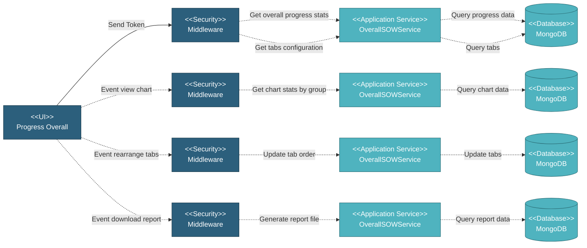

# 5.6.2 Progress Overall Page

The Progress Overall page provides a comprehensive view of project progress across all SOWs and item types. Users can track overall project progress, view progress by different categories (linepipe, bends, anodes, etc.), visualize progress through charts, and download progress reports.

## 5.6.1.1 User Interface

This page displays overall project progress with a comprehensive overview card and tabbed interface for different item types. The overall progress card shows "Overall Project Progress" title with last updated timestamp, two progress bars comparing base schedule vs current progress (schedule bar in dark grey, actual progress bar in teal if ahead or red if behind), and action buttons for viewing charts and downloading reports. Below the overview, a tabbed interface displays progress by item type Linepipe, Bends, Flange, and other item types if they're being used in the project. Each tab shows detailed progress data in table format with columns for SOW name, item description, quantities, progress percentage, and status indicators. Users can view progress S-curve chart by clicking the chart button (opens modal showing cumulative progress over time), download progress reports in PDF, rearrange tabs by dragging to customize view order, and drill down into specific SOW progress by clicking table rows. Empty state shows prompt to create and submit SOWs if no progress data exists. Upon page load, it sends token for authentication, retrieves overall progress statistics (schedule vs actual percentages), fetches tabs configuration with display order, and loads progress data for the initially selected tab.

## 5.6.1.2 Security

Middleware validates the authentication token sent from the Progress Overall UI. Only authenticated and authorized users can proceed to view and manage progress data.

**Security Checks:**
- `auth:api` - Validates JWT token via Laravel Passport
- `project.session:api` - Validates user has access to the project database
- `user.privileges` - Checks for `project.progress:R` privilege to view progress
- `user.privileges` - Checks for `project.progress:W` privilege to rearrange tabs

## 5.6.1.3 Application Services

### 5.6.1.3.1 Initial Data Retrieval

**OverallSOWService**: Retrieves overall project progress statistics by calculating aggregate progress across all submitted SOWs including base schedule percentage (planned progress based on dates), actual progress percentage (completed quantity vs total quantity), and last updated timestamp from most recent progress update. Progress bar color is determined by comparing actual vs schedule: teal if actual >= schedule, red if actual < schedule. Calculates weighted progress based on SOW weight that's been setup in Project Control.

**OverallSOWService**: Retrieves tabs configuration for progress view including tab ID and name (Linepipe, Bends, etc.), display order (user-customized or default), visibility status, and associated item type filter. Returns ordered list of tabs to display in the interface.

### 5.6.1.3.2 Progress Data Retrieved

Retrieves detailed progress data for selected tab/item type. Queries progress data filtered by item type including SOW-level progress with name, item description, quantities, and percentages progress breakdown. Aggregates data from multiple sources to provide comprehensive progress view. Returns structured data for table display with sorting capability.

### 5.6.1.3.3 Chart Statistics Retrieved

Retrieves chart data for visualizing progress trends. Queries historical progress data by date ranges including cumulative progress over time for S-curve chart and comparison of schedule vs actual progress. Calculates data points for chart rendering with proper date formatting and percentage values. Returns chart-ready data structure.

### 5.6.1.3.4 Tabs Rearranged

Updates display order of progress tabs based on user drag-and-drop action. Validates user has write permission and all tab IDs exist. Updates `seq` field for all affected tabs in sequence and maintains tab visibility settings. Returns success status and updated tabs configuration.

### 5.6.1.3.5 Report Downloaded

Generates and downloads progress report file in PDF format. Validates user has permission and report parameters. Queries comprehensive progress data including overall statistics, progress by item type and SOW-level details. Formats data according to report template and generates file with proper headers, formatting, and charts. Returns downloadable file stream.

### 5.6.1.3.6 Curve Status Checked

Checks if progress curve data needs to be updated or regenerated. Validates curve data exists and is up-to-date by comparing last curve generation timestamp with latest progress update, checking if new SOWs or work orders were added, and verifying data integrity. Returns status indicating if curve update is needed and triggers background job to regenerate if necessary.

## 5.6.1.4 Database

Progress data is retrieved and updated in MongoDB across several collections:

**Project Database:**
• **progress_sow_chart** - Historical progress data for chart generation
• **overall_tabs** - Tab configuration with display order and visibility
• **project_control_sow_list** - SOW weight and milestone data for calculations
