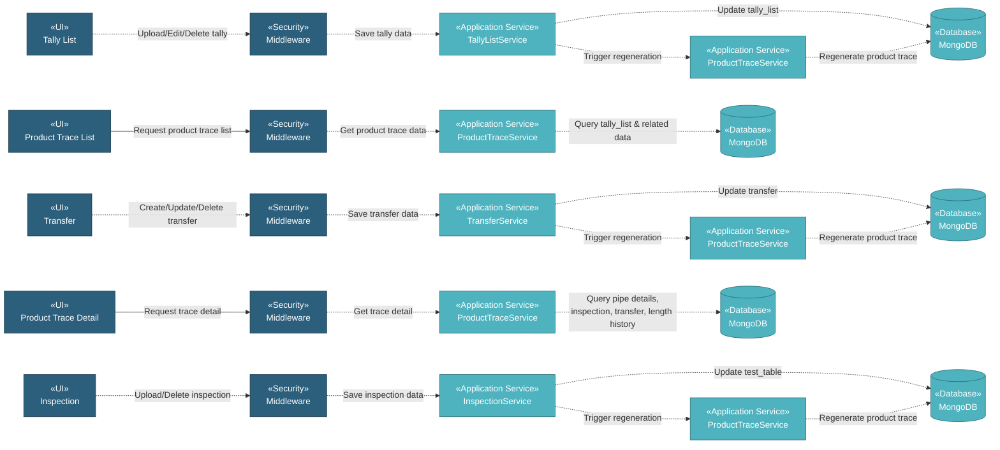

# 5.7.1 Product Trace

The Product Trace component provides complete material traceability from production through delivery. Users can track individual pipes by heat number, pipe number, and view comprehensive inspection results, transfer history, and length history for quality control and traceability reporting.

## 5.7.1.1 User Interface

### 5.7.1.1.1 Product Trace List

This is the entry point for viewing all product trace records. Users can view pipe numbers, heat numbers, item descriptions, lengths, pipe status, related SOWs, locations, and issues. The list provides DataTables with server-side processing for pagination, sorting, and filtering. Users can filter by item description, pipe status, SOW, location, issue, and item type. Upon page load, it sends authentication token and retrieves product trace data.

### 5.7.1.1.2 Product Trace Detail

This UI displays comprehensive traceability information for a selected pipe. Users can view pipe details, manufacturing inspection results, coating inspection results, transfer history, length history, and remarks. Each section provides detailed DataTables with sorting capabilities. The entire detail page can be exported to PDF including all available tabs (manufacturing inspection, coating inspection, transfer history, length history, and remarks). The detail view shows complete genealogy from SOW through work orders to final delivery.

### 5.7.1.1.3 Tally List (Trigger)

This trigger is from Work Order detail coating progress and Lenght History page. Users can upload tally files, view tally data, edit remarks, and delete tally records. The system automatically regenerates product trace data when tally records are created, updated, or deleted to maintain synchronized traceability information.

### 5.7.1.1.4 Transfer (Trigger)

This UI from the Transfer module triggers product trace regeneration when users create, update, or delete transfer tally records. The system automatically regenerates product trace data for all pipes in the transfer to update location and movement history.

### 5.7.1.1.5 Inspection (Trigger)

This UI from the Inspection module triggers product trace regeneration when users upload or delete inspection test results. The system automatically regenerates product trace data for all pipes in the work order to update inspection status and test results.

## 5.7.1.2 Security

Middleware validates the authentication token sent from Product Trace UIs. Only authenticated and authorized users can proceed to view product trace data.

**Security Checks:**
- `auth:api` - Validates JWT token via Laravel Passport
- `project.session:api` - Validates user has access to the project database
- `work_order:R` - Required to view product trace data

## 5.7.1.3 Application Services

### 5.7.1.3.1 Initial Data Retrieval

- **Product Trace Service**: Retrieves product trace list data from tally_list collection with related work order, SOW, transfer, and inspection information.
- **Item Service**: Fetches item master data for product trace display.
- **Specification Service**: Provides specification details for product trace context.
- **Mill Service**: Retrieves manufacturer/coater information for filtering.

### 5.7.1.3.2 Product Trace Data Generation

Generates product trace records from coating tally, transfer tally, and inspection data. Links pipes to work orders, SOWs, transfers, and inspection results. Updates product trace collection with comprehensive traceability information including pipe status, location, and condition.

**Product Trace Regeneration Triggers:**

The system automatically regenerates product trace data whenever pipe data changes through the `product_trace:update` command (dispatched as background job):

- **Regenerate**: Full regeneration of all product trace data for a project.
- **Single Tally**: Regenerates product trace for a single tally list record when created or updated.
- **Transfer Tally**: Regenerates product trace for all tally records linked to a transfer when transfer is created, updated, or deleted.
- **Inspection WO**: Regenerates product trace for all tally records linked to a work order when inspection data is uploaded or updated.
- **Deletion Tally**: Regenerates product trace when tally list records are deleted.
- **Deletion Inspection**: Regenerates product trace when inspection records are deleted.

These triggers ensure product trace data is always synchronized with the latest tally, transfer, and inspection data.

### 5.7.1.3.3 Product Trace Display Operations

The Product Trace Service provides the following operations for querying and displaying traceability data:

- **DataTables**: Retrieves product trace list with server-side pagination, sorting, and filtering.
- **Read**: Retrieves detailed product trace information for a specific pipe by pipe number and heat number.
- **Transfer History DataTable**: Retrieves transfer history for pipes with transfer details and locations.
- **Length History DataTable**: Retrieves length history for pipes with heat numbers and pipe numbers.
- **Manufacturing Inspection DataTable**: Retrieves manufacturing inspection results with test data.
- **Coating Inspection DataTable**: Retrieves coating inspection results with coating specifications.
- **Remarks DataTable**: Retrieves remarks and comments for pipes.
- **Export PDF**: Generates PDF export of product trace data including all tabs.

## 5.7.1.4 Database

MongoDB serves as the central data store for Product Trace. The component interacts with the following collections:

**Project Database (`{mongodb_project}_{project_code}`):**

- **`tally_list`** - Main product trace records. Key fields: _id, pipe_no, mill_pipe_no, heat_no, length, id_wo, id_item, id_spec_manufacturing, pipe_status, location, condition, remark.

- **`work_order`** - Work order records referenced by product trace.

- **`sow`** - SOW records linked to product trace for traceability.

- **`length_history`** - Cutting/length history records for pipes.

- **`transfer_cargo`** - Transfer cargo records for tracking pipe movements.

- **`transfer`** - Transfer records for shipment tracking.

- **`test_table`** - Inspection test results linked to pipes.

- **`material_test`** - Material test results for quality assurance.

- **`product_trace`** - Generated product trace summary records.

- **`item`** - Item master data referenced by product trace.

- **`specification`** - Specification master data referenced by product trace.

**Global Database (`mongodb_global`):**

- **`mill`** - Manufacturer/coater data for filtering product trace by vendor.

All query operations on product trace are handled through the Product Trace Service, ensuring consistent data access patterns and proper multi-tenant database routing.
