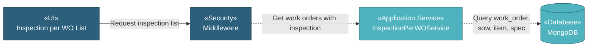

# 5.7.2 Inspection per WO

The Inspection per WO component provides a consolidated view and quick navigation to all work orders requiring inspection. This page serves as a shortcut for users to easily access work order inspection pages without navigating through the work order module. Users can view production and coating work orders organized by related SOWs and directly navigate to the inspection tab of any work order.

## 5.7.2.1 User Interface

### 5.7.2.1.1 Inspection per WO List

This page provides a quick overview of all work orders requiring inspection, serving as a navigation shortcut to access inspection pages directly. Users can view item descriptions, vendor names, activity types (manufacturing or coating), quantities, manufacturing specifications, and related SOW descriptions. The list displays both production and coating work orders organized by related SOWs (default sort). Users can sort by any column (item description, vendor, activity, quantity, manufacturing spec, related SOW) to find specific work orders. Clicking the detail button navigates directly to the Work Order detail page with the inspection tab opened, bypassing the need to navigate through the work order module. The list has no search, filter, or pagination - all work orders are displayed at once for easy scanning. Upon page load, it sends authentication token and retrieves work order inspection data.

## 5.7.2.2 Security

Middleware validates the authentication token sent from Inspection per WO UI. Only authenticated and authorized users can proceed to view inspection data.

**Security Checks:**
- `auth:api` - Validates JWT token via Laravel Passport
- `project.session:api` - Validates user has access to the project database
- `work_order:R` - Required to view inspection per work order data

## 5.7.2.3 Application Services

### 5.7.2.3.1 Initial Data Retrieval

- **Item Service**: Fetches item master data for work order display.
- **Specification Service**: Provides specification details for work orders.
- **Mill Service**: Retrieves manufacturer/coater information for vendor display.
- **Inspection per WO Service**: Retrieves all production and coating work orders with related SOW information.

### 5.7.2.3.2 Inspection per WO List Generation

Retrieves all work orders with process "production" or coating types from the work_order collection. Links each work order to its related SOWs and organizes them by SOW description. Calculates priority for sorting work orders within each SOW group (manufacturing work orders first, then coating work orders). Returns all work order records at once with item descriptions, vendor names, activity types, quantities, specifications, and related SOW information for display.

## 5.7.2.4 Database

MongoDB serves as the central data store for Inspection per WO. The component interacts with the following collections:

**Project Database (`{mongodb_project}_{project_code}`):**

- **`work_order`** - Work order records with inspection requirements. Key fields: _id, id_item, id_spec_manufacturing, id_spec_coating, id_manufacturer, type ("manufacturing" or "coating"), process (production or coating types), stage ("production" or "pqt"), item_type, qty, qty_unit.

- **`sow`** - SOW records linked to work orders for traceability.

- **`sow_coating`** - Coating SOW records for coating work orders.

- **`item`** - Item master data referenced by work orders.

- **`specification`** - Specification master data referenced by work orders.

**Global Database (`mongodb_global`):**

- **`mill`** - Manufacturer/coater data for vendor display.

All query operations on inspection per WO are handled through the Inspection per WO Service, ensuring consistent data access patterns and proper multi-tenant database routing.
