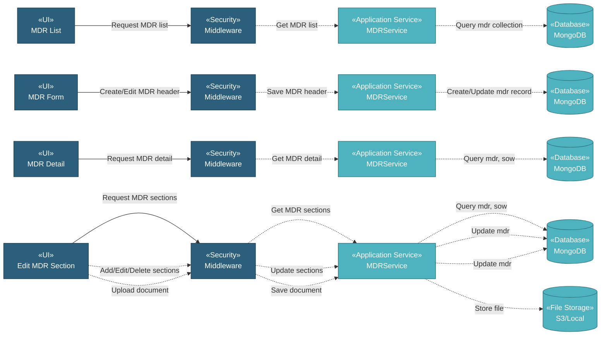

# 5.7.3 MDR (Manufacturing Data Record)

The MDR (Manufacturing Data Record) component manages documents from manufacturers through a hierarchical structure. Users can organize documents into sections and sub-sections, link MDRs to related SOWs, and upload document files with reference numbers and revision tracking.

## 5.7.3.1 User Interface

### 5.7.3.1.1 MDR List

This is the entry point for viewing all MDR records. Users can view Customer Reference No., Customer Revision No., Status (In Progress/Completed), and related SOWs (expandable to show SOW description, item name, and manufacturer). The list provides DataTables with server-side processing for pagination, sorting, and filtering. Users can add new MDRs, edit existing ones, copy MDR structures, or delete MDRs. Upon page load, it sends authentication token and retrieves MDR list data.

### 5.7.3.1.2 MDR Form (Create/Edit)

This UI allows users to create or edit MDR header information. Users enter Customer Reference No., Customer Revision No., and select multiple related SOWs. The form provides SOW multi-select with item and manufacturer information displayed. Upon submission, it creates the MDR record and navigates to the Edit MDR Section page.

### 5.7.3.1.3 MDR Detail

This is a read-only view displaying MDR information. Users can view Revision No., Reference No., Status (Draft/In Progress/Completed), and related Scope of Work (expandable). The page shows the hierarchical structure with sections, sub-sections, attachments, Customer Reference No., Rev. No, Original Document No., and Rev. No for each sub-section. Users can download attached documents and navigate to Edit Section page via the "Edit Section" button.

### 5.7.3.1.4 Edit MDR Section

This is the main MDR management page with hierarchical section structure. Users can manage sections and sub-sections through drag-and-drop reordering. Each section can contain multiple sub-sections. For each sub-section, users can add/edit document details including Customer Reference No., Rev. No, Original Document No., and Document Rev. No. Users can also upload document files (PDF/Excel) to sub-sections. The interface provides:
- **Add Section**: Creates new top-level section
- **Add Sub Section**: Creates sub-section under a section
- **Edit Doc**: Adds or edits document details for a sub-section (optional)
- **Drag handles**: Reorder sections and sub-sections
- **Edit/Delete buttons**: Modify or remove sections and sub-sections
- **Submit**: Saves all changes to the MDR structure

## 5.7.3.2 Security

Middleware validates the authentication token sent from MDR UIs. Only authenticated and authorized users can proceed to create, view, or manage MDRs.

**Security Checks:**
- `auth:api` - Validates JWT token via Laravel Passport
- `project.session:api` - Validates user has access to the project database
- `mdr:RW` - Required to create and manage MDR records
- `mdr:R` - Required to view MDR records

## 5.7.3.3 Application Services

### 5.7.3.3.1 Initial Data Retrieval

- **MDR Service**: Retrieves MDR list data from mdr collection.
- **SOW Service**: Fetches SOW options for linking to MDRs.

### 5.7.3.3.2 MDR Creation

Handles MDR header creation and saves it to MongoDB. This includes MDR reference number, revision number, and related SOW references. Creates hierarchical structure for sections and sub-sections.

### 5.7.3.3.3 MDR Operations

The MDR Service provides the following operations for managing MDR records:

- **Index**: Retrieves all MDR records for list display.
- **Create**: Creates new MDR header record with reference and revision numbers.
- **Create Section**: Adds new section to MDR with section name and description.
- **Create Document**: Uploads document file to sub-section and saves document details (document name, attachment name, attachment path).
- **Read**: Retrieves MDR detail with sections, sub-sections, documents, and related SOW information.
- **Edit**: Retrieves MDR data for editing header information.
- **Section Edit**: Retrieves MDR data for editing section structure.
- **Update**: Updates MDR header information and section structure.
- **Delete**: Removes MDR record and associated files.
- **DataTables**: Retrieves MDR list with server-side pagination, sorting, and filtering.
- **Download File**: Downloads attached document from MDR sub-section.
- **Copy**: Duplicates MDR structure with new reference number.

## 5.7.3.4 Database

MongoDB serves as the central data store for MDR. The component interacts with the following collections:

**Project Database (`{mongodb_project}_{project_code}`):**

- **`mdr`** - MDR records with hierarchical structure. Key fields: _id, mdr_ref (reference number), mdr_rev (revision number), status, sow_refs (array of SOW references with data), section (array of sections with section_list containing sub-sections and document_detail), created_at, created_by, updated_at, updated_by.

- **`sow`** - SOW records linked to MDRs for traceability.

**Global Database (`mongodb_global`):**

- **`mill`** - Manufacturer data for SOW display in MDR.

**File Storage (`S3 / Local`):**

- **MDR Documents**: Stored in path `mdr/{id_mdr}/{filename}`. Documents are material certificates, test reports, and quality documentation.

All create, update, and fetch operations on MDRs are handled through the MDR Service, ensuring consistent data access patterns and proper multi-tenant database routing.
