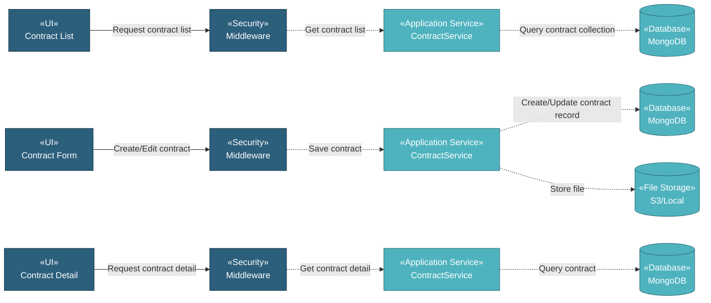

# 5.8.1 Contract

The Contract component manages contract documents through a simple CRUD interface. Users can upload contract documents with metadata including document number, document name, description, attachment, and tags for easy organization and retrieval.

## 5.8.1.1 User Interface

### 5.8.1.1.1 Contract List

This is the entry point for viewing all contract documents. Users can view Document No., Document Name, Description, Tags, Last Updated date, and Updated By name. The list provides DataTables with server-side processing for pagination, sorting, and filtering. Users can add new contracts, download attachments, copy contracts, delete contracts, or edit existing ones. Upon page load, it sends authentication token and retrieves contract list data.

### 5.8.1.1.2 Contract Form (Create/Edit)

This UI allows users to create or edit contract records. Users enter Document No., Document Name, Description, Tags, and upload document file attachment. Upon submission, it saves the contract record and uploads the file to storage.

### 5.8.1.1.3 Contract Detail

This is a read-only view displaying contract information. Users can view all contract details including Document No., Document Name, Description, Tags, Last Updated date, Updated By name, and download the attached document file.

## 5.8.1.2 Security

Middleware validates the authentication token sent from Contract UIs. Only authenticated and authorized users can proceed to create, view, or manage contracts.

**Security Checks:**
- `auth:api` - Validates JWT token via Laravel Passport
- `project.session:api` - Validates user has access to the project database
- `commercial.contract:RW` - Required to create and manage contract records
- `commercial.contract:R` - Required to view contract records

## 5.8.1.3 Application Services

### 5.8.1.3.1 Initial Data Retrieval

- **Contract Service**: Retrieves contract list data from contract collection.
- **User Service**: Fetches user information for displaying "Updated By" names.

### 5.8.1.3.2 Contract Operations

The Contract Service provides the following operations for managing contract records:

- **Index**: Retrieves all contract records for list display.
- **Create**: Creates new contract record with document metadata and file upload.
- **Read**: Retrieves contract detail with all information.
- **Update**: Updates contract record and optionally replaces the attached file.
- **Delete**: Removes contract record and associated file.
- **DataTables**: Retrieves contract list with server-side pagination, sorting, and filtering by document no, document name, description, tags, last updated, and updated by.
- **Download File**: Downloads attached document file.
- **Copy**: Duplicates contract record with new document number.

## 5.8.1.4 Database

MongoDB serves as the central data store for Contract. The component interacts with the following collections:

**Project Database (`{mongodb_project}_{project_code}`):**

- **`contract`** - Contract records. Key fields: _id, document_no, document_name, description, tags_label, attachment_name, attachment_path, created_at, created_by, updated_at, updated_by.

**Global Database (`mongodb_global`):**

- **`user`** - User data for displaying "Updated By" names.

**File Storage (`S3 / Local`):**

- **Contract Documents**: Stored in path `contract/{id}/{filename}`.

All create, update, and fetch operations on contracts are handled through the Contract Service, ensuring consistent data access patterns and proper multi-tenant database routing.
