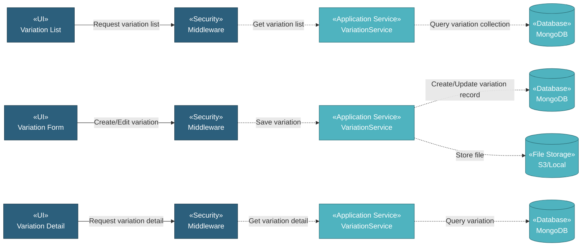

# 5.8.2 Variation List

The Variation List component manages variation order documents through a simple CRUD interface. Users can upload variation documents with metadata including variation number, description, date, document name, attachment, and status for tracking contract changes and modifications.

## 5.8.2.1 User Interface

### 5.8.2.1.1 Variation List

This is the entry point for viewing all variation order documents. Users can view variation records with DataTables providing server-side processing for pagination, sorting, and filtering. Users can add new variations, download attachments, copy variations, delete variations, or edit existing ones. Upon page load, it sends authentication token and retrieves variation list data.

### 5.8.2.1.2 Variation Form (Create/Edit)

This UI allows users to create or edit variation records. Users enter variation metadata and upload document file attachment. Upon submission, it saves the variation record and uploads the file to storage.

### 5.8.2.1.3 Variation Detail

This is a read-only view displaying variation information. Users can view all variation details and download the attached document file.

## 5.8.2.2 Security

Middleware validates the authentication token sent from Variation UIs. Only authenticated and authorized users can proceed to create, view, or manage variations.

**Security Checks:**
- `auth:api` - Validates JWT token via Laravel Passport
- `project.session:api` - Validates user has access to the project database
- `commercial.variation:RW` - Required to create and manage variation records
- `commercial.variation:R` - Required to view variation records

## 5.8.2.3 Application Services

### 5.8.2.3.1 Initial Data Retrieval

- **Variation Service**: Retrieves variation list data from variation collection.
- **User Service**: Fetches user information for displaying user-related data.

### 5.8.2.3.2 Variation Operations

The Variation Service provides the following operations for managing variation records:

- **Index**: Retrieves all variation records for list display.
- **Create**: Creates new variation record with metadata and file upload.
- **Read**: Retrieves variation detail with all information.
- **Update**: Updates variation record and optionally replaces the attached file.
- **Delete**: Removes variation record and associated file.
- **DataTables**: Retrieves variation list with server-side pagination, sorting, and filtering.
- **Download File**: Downloads attached document file.
- **Direct Copy**: Duplicates variation record.
- **Check Duplicate Variation**: Validates if variation already exists.

## 5.8.2.4 Database

MongoDB serves as the central data store for Variation. The component interacts with the following collections:

**Project Database (`{mongodb_project}_{project_code}`):**

- **`variation`** - Variation records. Key fields: _id, attachment_name, attachment_path, created_at, created_by, updated_at, updated_by.

**Global Database (`mongodb_global`):**

- **`user`** - User data for displaying user-related information.

**File Storage (`S3 / Local`):**

- **Variation Documents**: Stored in path `variation/{id}/{filename}`.

All create, update, and fetch operations on variations are handled through the Variation Service, ensuring consistent data access patterns and proper multi-tenant database routing.
