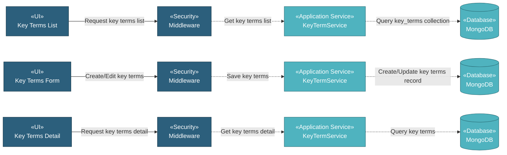

# 5.8.3 Key Terms

The Key Terms component manages key contract terms and conditions through a simple CRUD interface. Users can document important contract terms with metadata including key term name and key term value for easy reference and tracking.

## 5.8.3.1 User Interface

### 5.8.3.1.1 Key Terms List

This is the entry point for viewing all key contract terms. Users can view key terms records with DataTables providing server-side processing for pagination, sorting, and filtering. Users can add new key terms, download attachments (if applicable), copy key terms, delete key terms, or edit existing ones. Upon page load, it sends authentication token and retrieves key terms list data.

### 5.8.3.1.2 Key Terms Form (Create/Edit)

This UI allows users to create or edit key terms records. Users enter key term name, information type, and key term value. Upon submission, it saves the key terms record with processed information based on the information type.

### 5.8.3.1.3 Key Terms Detail

This is a read-only view displaying key terms information. Users can view all key terms details including term name, information type, key term value, last updated date, and updated by name.

## 5.8.3.2 Security

Middleware validates the authentication token sent from Key Terms UIs. Only authenticated and authorized users can proceed to create, view, or manage key terms.

**Security Checks:**
- `auth:api` - Validates JWT token via Laravel Passport
- `project.session:api` - Validates user has access to the project database
- `commercial.keyterms:RW` - Required to create and manage key terms records
- `commercial.keyterms:R` - Required to view key terms records

## 5.8.3.3 Application Services

### 5.8.3.3.1 Initial Data Retrieval

- **Key Term Service**: Retrieves key terms list data from key_terms collection.
- **User Service**: Fetches user information for displaying "Updated By" names.

### 5.8.3.3.2 Key Terms Operations

The Key Term Service provides the following operations for managing key terms records:

- **Index**: Retrieves all key terms records for list display.
- **Create**: Creates new key terms record with metadata and processes information based on information type.
- **Read**: Retrieves key terms detail with all information and populates information based on type.
- **Update**: Updates key terms record and processes information based on information type.
- **Delete**: Removes key terms record.
- **DataTables**: Retrieves key terms list with server-side pagination, sorting, and filtering.
- **Download File**: Downloads attached document file (if applicable).
- **Copy**: Duplicates key terms record.

## 5.8.3.4 Database

MongoDB serves as the central data store for Key Terms. The component interacts with the following collections:

**Project Database (`{mongodb_project}_{project_code}`):**

- **`key_terms`** - Key terms records. Key fields: _id, information_type, information, created_at, created_by, updated_at, updated_by.

**Global Database (`mongodb_global`):**

- **`user`** - User data for displaying "Updated By" names.

All create, update, and fetch operations on key terms are handled through the Key Term Service, ensuring consistent data access patterns and proper multi-tenant database routing.
