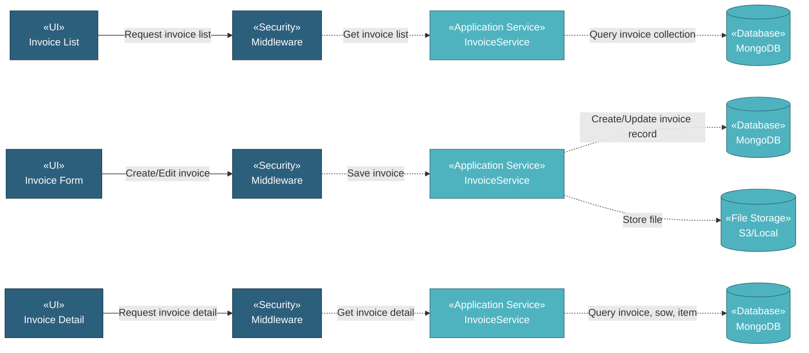

# 5.8.4 Invoices

The Invoices component manages invoice documents through a CRUD interface with relationships to SOW and SOW Lot. Users can create invoices linked to specific scope of work and delivery lots, tracking invoice numbers, dates, values, and payment status.

## 5.8.4.1 User Interface

### 5.8.4.1.1 Invoice List

This is the entry point for viewing all invoice documents. Users can view Invoice No., Invoice Date, SOW Name, Lot No., Value, Status, Last Updated date, and Updated By name. The list provides DataTables with server-side processing for pagination, sorting, and filtering. Users can add new invoices, download attachments, copy invoices, delete invoices, or edit existing ones. Upon page load, it sends authentication token and retrieves invoice list data.

### 5.8.4.1.2 Invoice Form (Create/Edit)

This UI allows users to create or edit invoice records. Users select related SOW and SOW Lot, then enter Invoice No., Invoice Date, Invoice Due Date, Value, Status, and upload invoice document file. The form provides SOW and Lot selection with item and manufacturer information displayed. Upon submission, it saves the invoice record with date conversions and uploads the file to storage.

### 5.8.4.1.3 Invoice Detail

This is a read-only view displaying invoice information. Users can view all invoice details including Invoice No., Invoice Date, Invoice Due Date, related SOW information (SOW description, item name, manufacturer name), Lot No., Value, Status, Last Updated date, Updated By name, and download the attached invoice document file.

## 5.8.4.2 Security

Middleware validates the authentication token sent from Invoice UIs. Only authenticated and authorized users can proceed to create, view, or manage invoices.

**Security Checks:**
- `auth:api` - Validates JWT token via Laravel Passport
- `project.session:api` - Validates user has access to the project database
- `commercial.invoice:RW` - Required to create and manage invoice records
- `commercial.invoice:R` - Required to view invoice records

## 5.8.4.3 Application Services

### 5.8.4.3.1 Initial Data Retrieval

- **Invoice Service**: Retrieves invoice list data from invoice collection.
- **SOW Service**: Fetches SOW options for linking invoices to scope of work and retrieves SOW details for invoice display.
- **User Service**: Fetches user information for displaying "Updated By" names.

### 5.8.4.3.2 Invoice Operations

The Invoice Service provides the following operations for managing invoice records:

- **Index**: Retrieves all invoice records for list display.
- **Get Invoices**: Retrieves invoices with optional filtering.
- **Create**: Creates new invoice record with SOW and Lot linkage, date conversions, and file upload.
- **Read**: Retrieves invoice detail with related SOW, Lot, Item, and Manufacturer information.
- **Delete**: Removes invoice record.
- **DataTables**: Retrieves invoice list with server-side pagination, sorting, and filtering by invoice no, invoice date, SOW name, lot no, value, status, last updated, and updated by.
- **Download File**: Downloads attached invoice document file.
- **Copy**: Duplicates invoice record.

## 5.8.4.4 Database

MongoDB serves as the central data store for Invoices. The component interacts with the following collections:

**Project Database (`{mongodb_project}_{project_code}`):**

- **`invoice`** - Invoice records. Key fields: _id, invoice_no, invoice_date, invoice_due_date, id_sow, id_lot, lot_no, value, status, document_name, attachment_name, attachment_path, created_at, created_by, updated_at, updated_by.

- **`sow`** - SOW records linked to invoices. Key fields: _id, desc, id_item, id_manufacturer.

- **`sow_lot`** - SOW Lot records linked to invoices.

- **`item`** - Item master data referenced by SOWs.

**Global Database (`mongodb_global`):**

- **`mill`** - Manufacturer data for SOW display in invoices.

- **`user`** - User data for displaying "Updated By" names.

**File Storage (`S3 / Local`):**

- **Invoice Documents**: Stored in path `invoice/{id}/{filename}`.

All create, update, and fetch operations on invoices are handled through the Invoice Service, ensuring consistent data access patterns and proper multi-tenant database routing.
