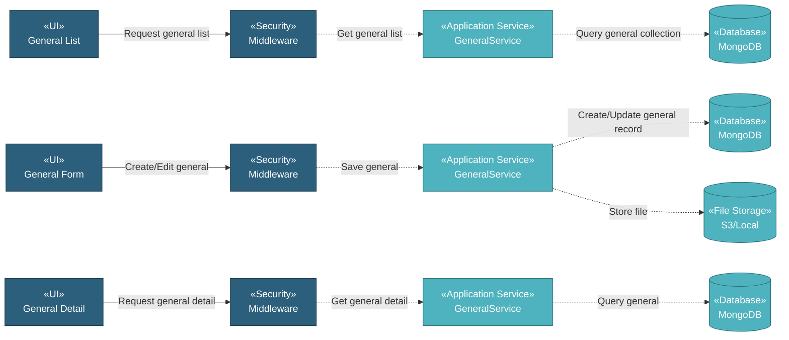

# 5.9.1 General

The General component manages general documentation through a simple CRUD interface. Users can upload general documents with metadata including document number, name, date, description, attachment, and tags for easy organization and retrieval.

## 5.9.1.1 User Interface

### 5.9.1.1.1 General List

This is the entry point for viewing all general documents. Users can view Doc Number, Name, Date, Description, Tags, Last Updated date, and Updated By name. The list provides DataTables with server-side processing for pagination, sorting, and filtering. Users can add new general documents, download attachments, copy documents, delete documents, or edit existing ones. Upon page load, it sends authentication token and retrieves general document list data.

### 5.9.1.1.2 General Form (Create/Edit)

This UI allows users to create or edit general document records. Users enter Doc Number, Name, Date, Description, Tags, and upload document file attachment. Upon submission, it saves the general document record and uploads the file to storage.

### 5.9.1.1.3 General Detail

This is a read-only view displaying general document information. Users can view all document details including Doc Number, Name, Date, Description, Tags, Last Updated date, Updated By name, and download the attached document file.

## 5.9.1.2 Security

Middleware validates the authentication token sent from General UIs. Only authenticated and authorized users can proceed to create, view, or manage general documents.

**Security Checks:**
- `auth:api` - Validates JWT token via Laravel Passport
- `project.session:api` - Validates user has access to the project database
- `documentation.general:RW` - Required to create and manage general document records
- `documentation.general:R` - Required to view general document records

## 5.9.1.3 Application Services

### 5.9.1.3.1 Initial Data Retrieval

- **General Service**: Retrieves general document list data from general collection.
- **User Service**: Fetches user information for displaying "Updated By" names.

### 5.9.1.3.2 General Operations

The General Service provides the following operations for managing general document records:

- **Index**: Retrieves all general document records for list display.
- **Create**: Creates new general document record with metadata and file upload.
- **Read**: Retrieves general document detail with all information.
- **Get Tag Options**: Retrieves available tag options for filtering.
- **Update**: Updates general document record and optionally replaces the attached file.
- **Delete**: Removes general document record and associated file.
- **DataTables**: Retrieves general document list with server-side pagination, sorting, and filtering by doc number, name, date, description, tags, last updated, and updated by.
- **Download File**: Downloads attached document file.
- **Copy**: Duplicates general document record with new document number.
- **Check Duplicate General**: Validates if general document name already exists.

## 5.9.1.4 Database

MongoDB serves as the central data store for General documents. The component interacts with the following collections:

**Project Database (`{mongodb_project}_{project_code}`):**

- **`general`** - General document records. Key fields: _id, doc_number, name, date, description, tags_label, attachment_name, attachment_path, created_at, created_by, updated_at, updated_by.

**Global Database (`mongodb_global`):**

- **`user`** - User data for displaying "Updated By" names.

**File Storage (`S3 / Local`):**

- **General Documents**: Stored in path `public/general/{id}/{filename}`.

All create, update, and fetch operations on general documents are handled through the General Service, ensuring consistent data access patterns and proper multi-tenant database routing.
