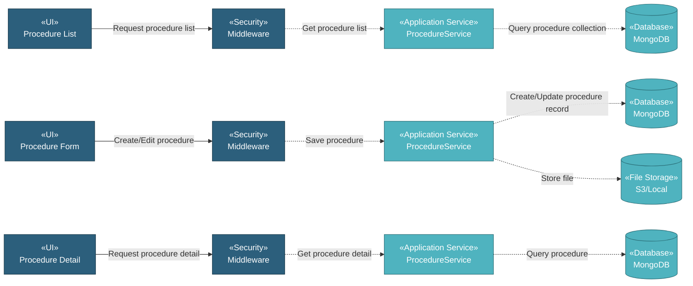

# 5.9.3 Procedures

The Procedures component manages procedure documents through a simple CRUD interface. Users can upload procedure documents with metadata including document number, name, date, description, attachment, and tags for easy organization and retrieval.

## 5.9.3.1 User Interface

### 5.9.3.1.1 Procedure List

This is the entry point for viewing all procedure documents. Users can view Doc Number, Name, Date, Description, Tags, Last Updated date, and Updated By name. The list provides DataTables with server-side processing for pagination, sorting, and filtering. Users can add new procedure documents, download attachments, copy documents, delete documents, or edit existing ones. Upon page load, it sends authentication token and retrieves procedure document list data.

### 5.9.3.1.2 Procedure Form (Create/Edit)

This UI allows users to create or edit procedure document records. Users enter Doc Number, Name, Date, Description, Tags, and upload document file attachment. Upon submission, it saves the procedure document record and uploads the file to storage.

### 5.9.3.1.3 Procedure Detail

This is a read-only view displaying procedure document information. Users can view all document details including Doc Number, Name, Date, Description, Tags, Last Updated date, Updated By name, and download the attached document file.

## 5.9.3.2 Security

Middleware validates the authentication token sent from Procedure UIs. Only authenticated and authorized users can proceed to create, view, or manage procedure documents.

**Security Checks:**
- `auth:api` - Validates JWT token via Laravel Passport
- `project.session:api` - Validates user has access to the project database
- `documentation.procedure:RW` - Required to create and manage procedure document records
- `documentation.procedure:R` - Required to view procedure document records

## 5.9.3.3 Application Services

### 5.9.3.3.1 Initial Data Retrieval

- **Procedure Service**: Retrieves procedure document list data from procedure collection.
- **User Service**: Fetches user information for displaying "Updated By" names.

### 5.9.3.3.2 Procedure Operations

The Procedure Service provides the following operations for managing procedure document records:

- **Index**: Retrieves all procedure document records for list display.
- **Create**: Creates new procedure document record with metadata and file upload.
- **Read**: Retrieves procedure document detail with all information.
- **Update**: Updates procedure document record and optionally replaces the attached file.
- **Delete**: Removes procedure document record and associated file.
- **DataTables**: Retrieves procedure document list with server-side pagination, sorting, and filtering by doc number, name, date, description, tags, last updated, and updated by.
- **Download File**: Downloads attached document file.
- **Copy**: Duplicates procedure document record with new document number.
- **Check Duplicate Procedure**: Validates if procedure name already exists.

## 5.9.3.4 Database

MongoDB serves as the central data store for Procedure documents. The component interacts with the following collections:

**Project Database (`{mongodb_project}_{project_code}`):**

- **`procedure`** - Procedure document records. Key fields: _id, doc_number, name, date, description, tags_label, attachment_name, attachment_path, created_at, created_by, updated_at, updated_by.

**Global Database (`mongodb_global`):**

- **`user`** - User data for displaying "Updated By" names.

**File Storage (`S3 / Local`):**

- **Procedure Documents**: Stored in path `procedure/{id}/{filename}`.

All create, update, and fetch operations on procedure documents are handled through the Procedure Service, ensuring consistent data access patterns and proper multi-tenant database routing.
