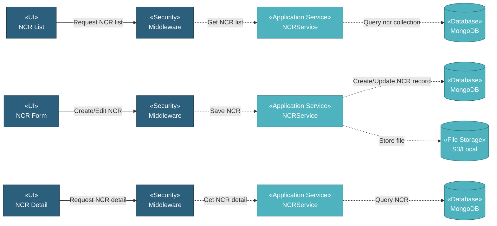

# 5.9.4 NCR (Non-Conformance Report)

The NCR component manages non-conformance report documents through a simple CRUD interface. Users can upload NCR documents with metadata including NCR reference number, document name, date, description, attachment, and status for tracking quality issues and corrective actions.

## 5.9.4.1 User Interface

### 5.9.4.1.1 NCR List

This is the entry point for viewing all non-conformance report documents. Users can view NCR records with DataTables providing server-side processing for pagination, sorting, and filtering. Users can add new NCR documents, download attachments, copy documents, delete documents, or edit existing ones. Upon page load, it sends authentication token and retrieves NCR document list data.

### 5.9.4.1.2 NCR Form (Create/Edit)

This UI allows users to create or edit NCR document records. Users enter NCR metadata and upload document file attachment. Upon submission, it saves the NCR document record and uploads the file to storage.

### 5.9.4.1.3 NCR Detail

This is a read-only view displaying NCR document information. Users can view all NCR details and download the attached document file.

## 5.9.4.2 Security

Middleware validates the authentication token sent from NCR UIs. Only authenticated and authorized users can proceed to create, view, or manage NCR documents.

**Security Checks:**
- `auth:api` - Validates JWT token via Laravel Passport
- `project.session:api` - Validates user has access to the project database
- `documentation.ncr:RW` - Required to create and manage NCR document records
- `documentation.ncr:R` - Required to view NCR document records

## 5.9.4.3 Application Services

### 5.9.4.3.1 Initial Data Retrieval

- **NCR Service**: Retrieves NCR document list data from ncr collection.
- **User Service**: Fetches user information for displaying user-related data.

### 5.9.4.3.2 NCR Operations

The NCR Service provides the following operations for managing NCR document records:

- **Index**: Retrieves all NCR document records for list display.
- **Create**: Creates new NCR document record with metadata and file upload.
- **Read**: Retrieves NCR document detail with all information.
- **Update**: Updates NCR document record and optionally replaces the attached file.
- **Delete**: Removes NCR document record and associated file.
- **DataTables**: Retrieves NCR document list with server-side pagination, sorting, and filtering.
- **Download File**: Downloads attached document file.
- **Copy**: Duplicates NCR document record.

## 5.9.4.4 Database

MongoDB serves as the central data store for NCR documents. The component interacts with the following collections:

**Project Database (`{mongodb_project}_{project_code}`):**

- **`ncr`** - NCR document records. Key fields: _id, attachment_name, attachment_path, created_at, created_by, updated_at, updated_by.

**Global Database (`mongodb_global`):**

- **`user`** - User data for displaying user-related information.

**File Storage (`S3 / Local`):**

- **NCR Documents**: Stored in path `ncr/{id}/{filename}`.

All create, update, and fetch operations on NCR documents are handled through the NCR Service, ensuring consistent data access patterns and proper multi-tenant database routing.
