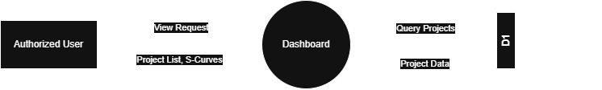

# 7.1.1 Dashboard - Data Flow Diagram

This document illustrates the data flow for the Global Dashboard in the Tubestream system, showing how users interact with the project list, S-curve visualizations, and project overview.

---

## 7.1.1.1 Dashboard - Data Flow Diagram

This image represents a Level 0 Data Flow Diagram (DFD) for the Global Dashboard process in Tubestream. It outlines the key interactions between users and the system, showing how data flows between entities and the Dashboard process.

*Figure: Dashboard - Data Flow Diagram Level 0*

This diagram illustrates the Global Dashboard process in Tubestream Pipeline, showing how data flows between users and the system. The **Authorized User** accesses the dashboard to view assigned projects based on their role and permissions.

The Dashboard process serves as the main entry point after login, providing an overview of all accessible projects. It displays project lists with active/closed project counts and S-curve data for progress visualization. Users also can navigate to specific project modules. The dashboard ensures role-based project visibility so users only see projects they have access to.

---

## Code References

**Backend:**
- `app/Http/Controllers/Api/Globals/DashboardController.php`
- `app/Services/Globals/DashboardService.php`
- `app/Services/Globals/ProjectService.php`
- `app/Repositories/Globals/Project/ProjectRepository.php`

**Frontend:**
- `resources/js/components/global/dashboard/DashboardComponent.vue`
- `resources/js/components/global/dashboard/ProjectCardComponent.vue`
- `resources/js/components/global/dashboard/SCurveChartComponent.vue`
- `resources/js/store/modules/globals/dashboard/actions.js`

---

**Status**: ✅ Verified against codebase implementation
