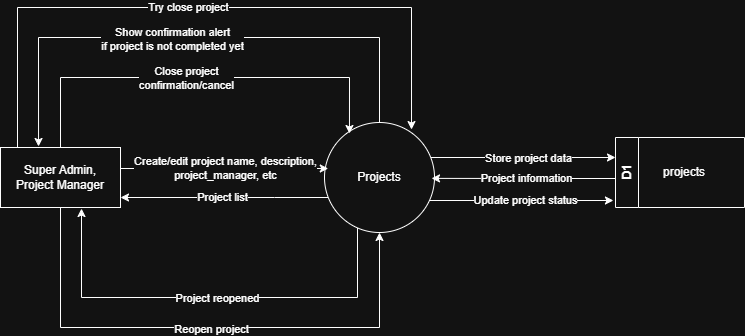

# 7.1.2 Project Management - Data Flow Diagram

This document illustrates the data flow for Project Management operations in the Tubestream Pipeline system, showing how users interact with project creation, listing, editing, and status management processes.

---

## 7.1.2.1 Project Management - Data Flow Diagram Level 0

This image represents a Level 0 Data Flow Diagram (DFD) for the main process of Project Management in Tubestream Pipeline. It outlines the key interactions between users and the system, showing how data flows between entities and the project management process.

*Figure: Project Management - Data Flow Diagram Level 0*

This diagram illustrates the Project Management process in Tubestream Pipeline, showing how data flows between the Super Admin/Project Manager and the system. The process begins when the **Super Admin** or **Project Manager** creates or edits projects by providing project information (name, description, project manager, etc.). The system processes this data in the Projects module and stores the project information in the projects data store (D1).

The system provides project information back to users through the project list view. When users need to update project status, they can close projects through a confirmation workflow. If a project is not completed yet, the system shows a confirmation alert before allowing the close action. Users can also reopen closed projects when needed.

This process supports proper project lifecycle management by validating project data before storage, managing project status transitions (Active/Closed), requiring confirmation for closing incomplete projects, supporting project reopening for flexibility, and maintaining project information accessible through the projects database.