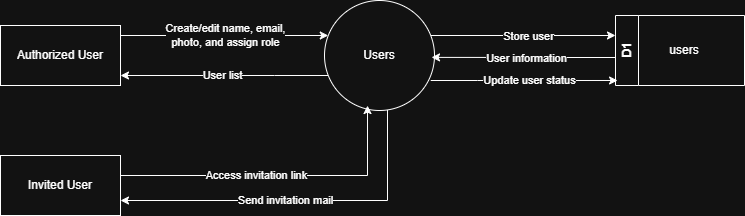

# 7.1.3 User Management - Data Flow Diagram

This document illustrates the data flow for User Management operations in the Tubestream Pipeline system, showing how authorized users manage user accounts, roles, and access control.

---

## 7.1.3.1 User Management - Data Flow Diagram Level 0

This image represents a Level 0 Data Flow Diagram (DFD) for the main process of User Management in Tubestream Pipeline. It outlines the key interactions between users and the system, showing how data flows between entities and the user management process.

*Figure: User Management - Data Flow Diagram Level 0*

This diagram illustrates the User Management process in Tubestream Pipeline, showing how data flows between authorized users and the system. The process begins when an **Authorized User** (Super Admin) creates or edits user accounts by providing user information (name, email, photo, role assignment). The system processes this data in the Users module and stores the user information in the users data store (D1).

The system provides user information back to authorized users through the user list view. When a new user is created, the system generates an invitation link and sends an invitation email to the **Invited User**. The invited user receives the invitation mail and can access the system using the activation link provided.

This process supports proper user administration and access control by validating email uniqueness before creating users, managing user roles and permissions, sending automated invitation emails with activation links, storing user data securely in the users database, and providing user status updates for account management.

---

## Code References

**Backend:**
- `app/Http/Controllers/Api/Globals/UserController.php`
- `app/Services/Globals/UserService.php`
- `app/Repositories/Globals/User/UserRepository.php`
- `app/Services/Commons/EmailService.php`

**Frontend:**
- `resources/js/components/global/user/UserComponent.vue`
- `resources/js/components/global/user/UserFormComponent.vue`
- `resources/js/store/modules/globals/user/actions.js`

---

**Status**: ✅ Verified against Section 5.1.3 Component Design
