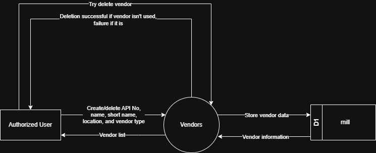
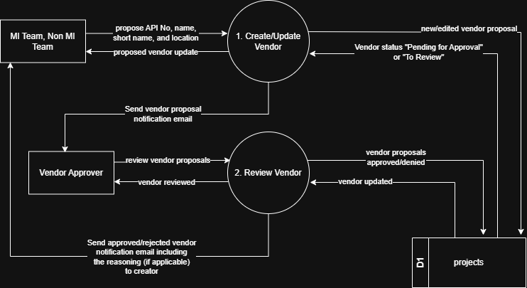

# 7.1.4 Vendor Management - Data Flow Diagram

This document illustrates the data flow for Vendor Management operations in the Tubestream system, showing how users interact with vendor/manufacturer (mills) master data including creation, approval workflow, and status management.

---

## 7.1.4.1 Vendor Management - Data Flow Diagram Level 0

This image represents a Level 0 Data Flow Diagram (DFD) for the main process of Vendor Management in Tubestream Pipeline. It outlines the key interactions between users and the system, showing how data flows between entities and the vendor management process.

*Figure: Vendor Management - Data Flow Diagram Level 0*

This diagram illustrates the Vendor Management process in Tubestream Pipeline, showing how data flows between authorized users and the system. The process begins when an **Authorized User** creates or deletes vendor/manufacturer records by providing vendor information (API number, name, short name, location, vendor type). The system processes this data in the Vendors module and stores the vendor information in the mill data store (D1).

The system provides vendor information back to authorized users through the vendor list view. When users attempt to delete a vendor, the system validates vendor usage by checking if the vendor is referenced in any project. If the vendor is in use, deletion fails and the user receives a failure notification. If the vendor is not used, deletion succeeds.

This process supports proper vendor master data management by validating vendor data before storage, preventing deletion of vendors that are actively used in projects, maintaining vendor information accessible through the mill database, and ensuring data integrity across the system.

---

## 7.1.4.2 Vendor Management - Data Flow Diagram Level 1

This Data Flow Diagram (DFD) level 1 visualizes the Vendor Management process in Tubestream Pipeline, depicting the flow of data between users, processes, and databases. It offers a more detailed view compared to the Level 0 diagram above.

*Figure: Vendor Management - Data Flow Diagram Level 1*

The key components are explained in the table below.

**Table: Vendor Management - Data Flow Diagram Level 1 Key Components**

| No. | User | Input | Process | Output |
|-----|------|-------|---------|--------|
| 1 | MI Team, Non MI Team | Propose API No, name, short name, location | Create/Update Vendor | New/edited vendor proposal, status "Pending for Approval" or "To Review" |
| 2 | Vendor Approver | Review vendor proposals | Review Vendor | Vendor approved/denied, notification email sent to creator |

---

## Code References

**Backend:**
- `app/Http/Controllers/Api/Globals/MillController.php`
- `app/Services/Globals/MillService.php`
- `app/Services/Globals/MillHistoryService.php`
- `app/Repositories/Globals/Mill/MillRepository.php`
- `app/Repositories/Globals/Mill/MillHistoryRepository.php`

**Frontend:**
- `resources/js/components/global/mill/MillComponent.vue`
- `resources/js/components/global/mill/MillFormComponent.vue`
- `resources/js/store/modules/globals/mill/actions.js`

---

**Status**: ✅ Verified against Section 5.1.4 Component Design
