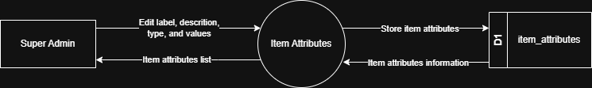

# 7.1.5 Item Attributes - Data Flow Diagram

This document illustrates the data flow for Item Attributes Management operations in the Tubestream system, showing how users manage global item attribute definitions (e.g: Grade, Supplementary, Delivery Condition) used to standardize material specifications across all projects.

---

## 7.1.5.1 Item Attributes - Data Flow Diagram Level 0

This image represents a Level 0 Data Flow Diagram (DFD) for the main process of Item Attributes Management in Tubestream Pipeline. It outlines the key interactions between users and the system, showing how data flows between entities and the item attributes process.

*Figure: Item Attributes - Data Flow Diagram Level 0*

This diagram illustrates the Item Attributes Management process in Tubestream Pipeline, showing how data flows between the Super Admin and the system. The process begins when the **Super Admin** edits item attribute definitions by providing attribute information (label, description, type, and values). The system processes this data in the Item Attributes module and stores the attribute information in the item_attributes data store (D1).

The system provides item attributes information back to the Super Admin through the item attributes list view. These global item attributes (e.g: Grade, Supplementary, Delivery Condition) are used to standardize material specifications across all projects, supporting different attribute types (Single Selection, Multiple Selection, Numeric) for consistent data entry and reporting.

---

## Code References

**Backend:**
- `app/Http/Controllers/Api/Globals/ItemAttributesController.php`
- `app/Services/Globals/ItemAttributesService.php`
- `app/Repositories/Globals/ItemAttributes/ItemAttributesRepository.php`

**Frontend:**
- `resources/js/components/global/item-attributes/ItemAttributesComponent.vue`
- `resources/js/store/modules/globals/item-attributes/actions.js`

---

**Status**: ✅ Verified against Section 5.1.5 Component Design
