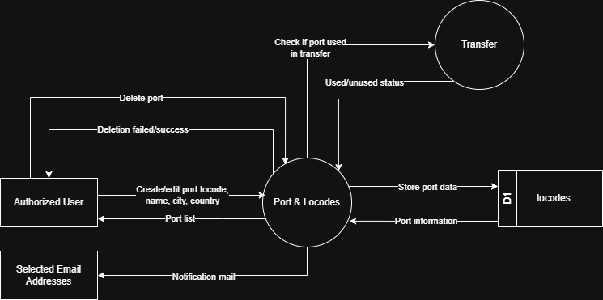

# 7.1.6 Ports & Locodes - Data Flow Diagram

This document illustrates the data flow for Ports & Locodes Management operations in the Tubestream system, showing how users manage UN/LOCODE port reference data used for transfer tracking, shipment management, and vessel location tracking across all projects.

---

## 7.1.6.1 Ports & Locodes - Data Flow Diagram Level 0

This image represents a Level 0 Data Flow Diagram (DFD) for the main process of Ports & Locodes Management in Tubestream Pipeline. It outlines the key interactions between users and the system, showing how data flows between entities and the ports management process.

*Figure: Ports & Locodes - Data Flow Diagram Level 0*

This diagram represents the Ports & Locodes process, which manages UN/LOCODE port reference data used across all projects for transfer routing and vessel tracking. An Authorized User (Super Admin) creates or edits port entries by providing LOCODE identifier, port name, city, and country. The system processes this data in the Ports & Locodes module and stores the information in the locodes data store (D1).

Before deletion, the system validates port usage by checking if the port is referenced in any transfer records. If the port is in use, deletion is prevented and the user receives a failure notification. If unused, the port is deleted successfully. Email notifications are sent to selected addresses when ports are created, updated, or deleted.

This process supports accurate location tracking by ensuring all ports are properly documented with UN/LOCODE standards, validated before deletion to prevent breaking transfer routes, searchable by LOCODE/name/city/country, and accessible across all projects for consistent transfer routing.

---

## Code References

**Backend:**
- `app/Http/Controllers/Api/Globals/LocodeController.php`
- `app/Services/Globals/LocodeService.php`
- `app/Repositories/Globals/Locode/LocodeRepository.php`

**Frontend:**
- `resources/js/components/global/locodes/LocodesComponent.vue`
- `resources/js/store/modules/globals/locodes/actions.js`

---

**Status**: ✅ Verified against Section 5.1.6 Component Design
