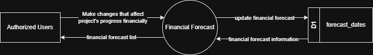

# 7.1.7 Financial Forecast - Data Flow Diagram

This document illustrates the data flow for Financial Forecast operations in the Tubestream system, showing how users generate financial forecast reports from SOW (Scope of Work) data with Excel export functionality for financial planning and analysis.

---

## 7.1.7.1 Financial Forecast - Data Flow Diagram Level 0

This image represents a Level 0 Data Flow Diagram (DFD) for the main process of Financial Forecast in Tubestream Pipeline. It outlines the key interactions between users and the system, showing how data flows between entities and the financial forecast process.

*Figure: Financial Forecast - Data Flow Diagram Level 0*

This diagram illustrates the Financial Forecast process in Tubestream Pipeline, showing how data flows between authorized users and the system. The process begins when **Authorized Users** make changes that affect project progress financially (such as SOW delivery schedule updates, pricing changes, or quantity adjustments). The system processes these changes in the Financial Forecast module and updates the financial forecast data in the forecast_dates data store (D1).

The system provides financial forecast information back to authorized users through the financial forecast list view, showing projected revenue and delivery schedules based on SOW data. This enables financial planning and analysis by automatically calculating forecasts from project progress data.

---

## Code References

**Backend:**
- `app/Http/Controllers/Api/Globals/ForecastController.php`
- `app/Services/Globals/ForecastService.php`
- `app/Repositories/Globals/Forecast/ForecastDateRepository.php`

**Frontend:**
- `resources/js/components/global/forecast/ForecastComponent.vue`
- `resources/js/store/modules/globals/forecast/actions.js`

---

**Status**: ✅ Verified against Section 5.1.7 Component Design
