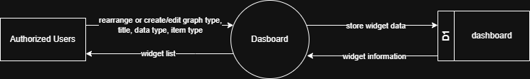

# 7.10 Dashboard Module - Data Flow Diagram

This document illustrates the data flow for Dashboard operations in the Tubestream system, showing how users interact with customizable widgets, progress visualizations, and project metrics.

---

## 7.10.1 Dashboard Module - Data Flow Diagram Level 0

This image represents a Level 0 Data Flow Diagram (DFD) for the main process of Dashboard in Tubestream Pipeline. It outlines the key interactions between users and the system, showing how data flows between entities and the dashboard process.

*Figure: Dashboard Module - Data Flow Diagram Level 0*

This diagram illustrates the Dashboard process in Tubestream Pipeline, showing how data flows between authorized users and the system. The process begins when **Authorized Users** (all users assigned to the project) rearrange or create/edit widgets by specifying graph type, title, data type, and item type. The system processes this configuration in the Dashboard module and stores the widget data in the dashboard data store (D1).

The system provides widget information back to authorized users through the widget list view, displaying personalized dashboards with customizable widgets (progress circles, S-curves, transfer progress, and other project metrics). Each user can configure their own dashboard layout and widget preferences.

This process supports personalized project visualization by allowing users to customize their dashboard layout, supporting multiple widget types for different metrics, storing individual user widget configurations, and providing real-time progress data visualization based on user permissions and preferences.

---

## Code References

**Backend:**
- `app/Http/Controllers/Api/Projects/DashboardController.php`
- `app/Services/Projects/DashboardService.php`
- `app/Services/Projects/OverallSOWService.php`
- `app/Repositories/Projects/Dashboard/DashboardRepository.php`

**Frontend:**
- `resources/js/components/project/dashboard/DashboardComponent.vue`
- `resources/js/components/project/dashboard/widgets/ProgressCircleWidget.vue`
- `resources/js/components/project/dashboard/widgets/SCurveWidget.vue`
- `resources/js/store/modules/projects/dashboard/actions.js`

---

**Status**: ✅ Verified against codebase implementation
