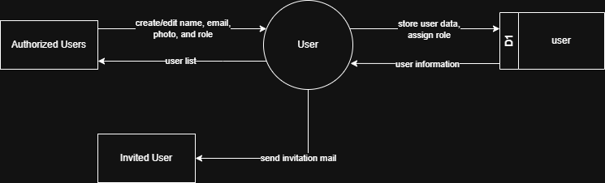

# 7.2.1 User Management - Data Flow Diagram

This document illustrates the data flow for User Management operations in the Setup Module, showing how users manage project-specific user access, roles, and privileges.

---

## 7.2.1.1 User Management - Data Flow Diagram Level 0

This image represents a Level 0 Data Flow Diagram (DFD) for the main process of User Management in Tubestream Pipeline Setup Module. It outlines the key interactions between users and the system, showing how data flows between entities and the user management process.

*Figure: User Management - Data Flow Diagram Level 0*

This diagram illustrates the User Management process in Tubestream Pipeline Setup Module, showing how data flows between authorized users and the system. The process begins when **Authorized Users** (Project Manager) create or edit project user assignments by providing user information (name, email, photo, and role). The system processes this data in the User module and stores the user data along with role assignments in the user data store (D1).

When a new user is added to the project, the system sends an invitation mail to the **Invited User**, notifying them of their project access. The system provides user information back to authorized users through the user list view, showing all users assigned to the project with their roles and privileges.

This process supports proper project access control by managing project-specific user assignments, assigning project roles (Project Team, Customer, Non MI Team), storing user-project associations with role privileges, sending invitation emails to newly added users, and maintaining the project team roster accessible through the user database.

---

## Code References

**Backend:**
- `app/Http/Controllers/Api/Projects/UserController.php`
- `app/Services/Globals/GlobalUserService.php`
- `app/Services/Projects/DashboardService.php`

**Frontend:**
- `resources/js/components/project/setup/UserComponent.vue`

---

**Status**: ✅ Verified against Section 5.2.1 Component Design
