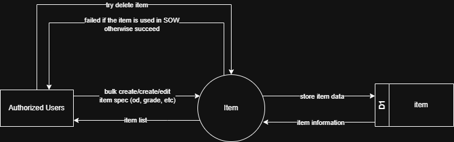

# 7.2.2 Item Management - Data Flow Diagram

This document illustrates the data flow for Item Management operations in the Setup Module, showing how users manage project-specific item catalog and specifications.

---

## 7.2.2.1 Item Management - Data Flow Diagram Level 0

This image represents a Level 0 Data Flow Diagram (DFD) for the main process of Item Management in Tubestream Pipeline Setup Module. It outlines the key interactions between users and the system, showing how data flows between entities and the item management process.

*Figure: Item Management - Data Flow Diagram Level 0*

This diagram illustrates the Item Management process in Tubestream Pipeline Setup Module, showing how data flows between authorized users and the system. The process begins when **Authorized Users** bulk create, create, or edit project-specific items by providing item specifications (OD, grade, etc.). The system processes this data in the Item module and stores the item data in the item data store (D1).

When users attempt to delete an item, the system validates item usage by checking if the item is used in any SOW. If the item is in use, deletion fails and the user receives a failure notification. If the item is not used, deletion succeeds. The system provides item information back to authorized users through the item list view.

This process supports proper item catalog management by managing project-specific item specifications, supporting bulk creation for efficient setup, validating item deletion to prevent breaking SOW references, storing item data with complete specifications (OD, grade, connection type, etc.), and maintaining the item catalog accessible through the item database.

---

## Code References

**Backend:**
- `app/Http/Controllers/Api/Projects/ItemController.php`
- `app/Services/Projects/ItemService.php`

**Frontend:**
- `resources/js/components/project/setup/ItemComponent.vue`

---

**Status**: ✅ Verified against Section 5.2.2 Component Design
