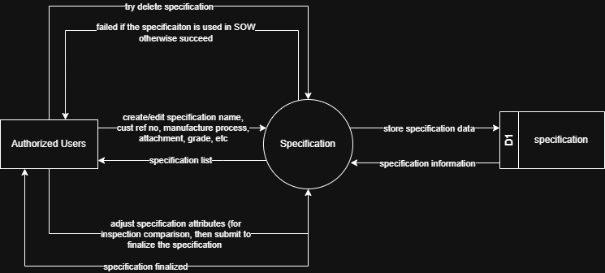

# 7.2.3 Specification Management - Data Flow Diagram

This document illustrates the data flow for Specification Management operations in the Setup Module, showing how users manage technical specifications and requirements.

---

## 7.2.3.1 Specification Management - Data Flow Diagram Level 0

This image represents a Level 0 Data Flow Diagram (DFD) for the main process of Specification Management in Tubestream Pipeline Setup Module. It outlines the key interactions between users and the system, showing how data flows between entities and the specification management process.

*Figure: Specification Management - Data Flow Diagram Level 0*

This diagram illustrates the Specification Management process in Tubestream Pipeline Setup Module, showing how data flows between authorized users and the system. The process begins when **Authorized Users** create or edit specifications by providing specification information (name, serial no, manufacture process, attachment, grade, etc.). The system processes this data in the Specification module and stores the specification data in the specification data store (D1).

Users can also adjust specification attributes for inspection comparison, then submit to finalize the specification. The system returns specification finalized confirmation to the user. When users attempt to delete a specification, the system validates specification usage by checking if the specification is used in any SOW. If the specification is in use, deletion fails and the user receives a failure notification. If not used, deletion succeeds. The system provides specification information back to authorized users through the specification list view.

This process supports proper technical specification management by managing project-specific specifications with complete details, supporting specification attribute adjustment for inspection comparison, finalizing specifications for use in work orders, validating specification deletion to prevent breaking SOW references, and maintaining the specification catalog accessible through the specification database.

---

## Code References

**Backend:**
- `app/Http/Controllers/Api/Projects/SpecificationController.php`
- `app/Services/Projects/SpecificationService.php`

**Frontend:**
- `resources/js/components/project/setup/SpecificationComponent.vue`

---

**Status**: ✅ Verified against Section 5.2.3 Component Design
