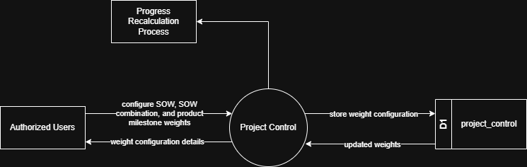

# 7.2.4 Project Control - Data Flow Diagram

This document illustrates the data flow for Project Control operations in the Setup Module, showing how users configure project-level settings and controls.

---

## 7.2.4.1 Project Control - Data Flow Diagram Level 0

This image represents a Level 0 Data Flow Diagram (DFD) for the main process of Project Control in Tubestream Pipeline Setup Module. It outlines the key interactions between users and the system, showing how data flows between entities and the project control process.

*Figure: Project Control - Data Flow Diagram Level 0*

This diagram illustrates the Project Control process in Tubestream Pipeline Setup Module, showing how data flows between authorized users and the system. The process begins when **Authorized Users** configure progress weighting by setting SOW weights, SOW combination weights, and product milestone weights. The system processes this configuration in the Project Control module and stores the weight configuration in the project_control data store (D1).

When weight configurations are updated, the system retrieves the updated weights from the database and triggers the **Progress Recalculation Process** to recalculate all SOW and Work Order progress percentages based on the new weight settings. The system provides weight configuration details back to authorized users, showing current weight distributions and review status.

This process supports accurate project progress tracking by managing SOW list weight percentages (distribution across SOWs based on value), configuring SOW combination weights (Manufacturing-Coating-Delivery stage distributions), setting product milestone weights (Production, Documentation stage contributions), automatically triggering progress recalculation when weights change, and maintaining weight configurations accessible through the project_control database.

---

## Code References

**Backend:**
- `app/Http/Controllers/Api/Projects/ProjectControlController.php`
- `app/Services/Projects/ProjectControlService.php`

**Frontend:**
- `resources/js/components/project/setup/ProjectControlComponent.vue`

---

**Status**: ✅ Verified against Section 5.2.5 Component Design
