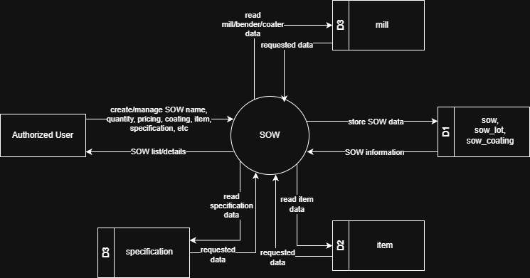
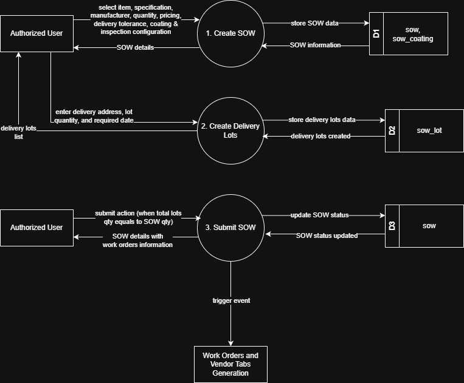

# 7.3 SOW Module - Data Flow Diagram

This document illustrates the data flow for Scope of Work (SOW) Management operations in the Tubestream Pipeline system, showing how users interact with SOW creation, listing, editing, and detail viewing processes.

---

## 7.3.1 SOW Module - Data Flow Diagram Level 0

This image represents a Level 0 Data Flow Diagram (DFD) for the main process of SOW Management in Tubestream Pipeline. It outlines the key interactions between users and the system, showing how data flows between entities and the SOW Management process.

*Figure: SOW Module - Data Flow Diagram Level 0*

This diagram represents the SOW (Scope of Work) Management process, which manages project scope items and specifications. An Authorized User creates or manages SOW by providing SOW name, quantity, pricing, coating requirements, item details, and specification information. The system processes this data in the SOW process (central circle).

The SOW process interacts with four data stores: it reads mill/bender/coater data from the mill data store (D3), reads specification data from the specification data store (D2), and reads item data from the item data store (D4). The system stores SOW data in the sow, sow_lot, and sow_coating data store (D1) and provides SOW list and details back to the Authorized User.

This process supports project scope management by ensuring SOW items are properly defined with complete item specifications, manufacturer assignments, coating configurations, and pricing information. The system retrieves reference data from both global data stores (mill) and project data stores (item, specification) to populate SOW options and validates all inputs before storing SOW records.

---

## 7.3.2 SOW Module - Data Flow Diagram Level 1

This Data Flow Diagram (DFD) level 1 visualizes the SOW Management process in Tubestream Pipeline, depicting the flow of data between users, processes, and databases. It breaks down the SOW process into three sub-processes: Create SOW, Create Delivery Lots, and Submit SOW. The image below presents the detailed DFD for Tubestream Pipeline's SOW Management process.

*Figure: SOW Module - Data Flow Diagram Level 1*

The key components are explained in the table below.

**Table: SOW Module - Data Flow Diagram Level 1 Key Components**

| No. | User | Input | Process | Output |
|-----|------|-------|---------|--------|
| 1 | Authorized User | Select item, specification, manufacturer, quantity, pricing, delivery tolerance, coating & inspection configuration | 1. Create SOW | Stores SOW data in sow and sow_coating data stores (D1). Returns SOW details to user |
| 2 | Authorized User | Enter delivery address, lot quantity, and required date | 2. Create Delivery Lots | Stores delivery lots data in sow_lot data store (D2). Returns delivery lots list to user. System validates and creates delivery lot records |
| 3 | Authorized User | Submit action (when total lots qty equals to SOW qty) | 3. Submit SOW | Updates SOW status in sow data store (D3). Returns SOW details with work orders information to user. Triggers event to generate Work Orders and Vendor Tabs |

---

## Code References

**Backend:**
- `app/Http/Controllers/Api/Projects/SOWController.php`
- `app/Services/Projects/SOWService.php`
- `app/Repositories/Projects/SOW/SOWRepository.php`
- `app/Services/Projects/WorkOrderService.php`
- `app/Services/Projects/ProjectControlService.php`

**Frontend:**
- `resources/js/components/project/sow/SOWComponent.vue`
- `resources/js/components/project/sow/SOWFormComponent.vue`
- `resources/js/components/project/sow/SOWDetailComponent.vue`
- `resources/js/store/modules/projects/sow/actions.js`

---

**Status**: ✅ Verified against codebase implementation
