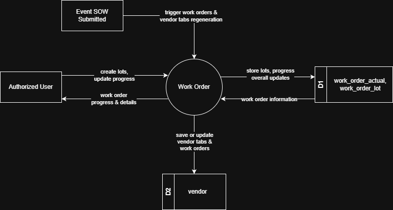
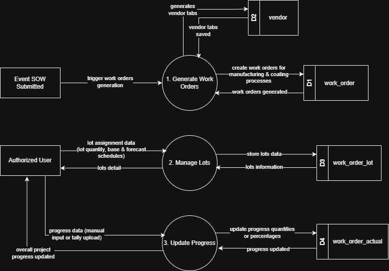

# 7.4 Work Order Module - Data Flow Diagram

This document illustrates the data flow for Work Order Management operations in the Tubestream Pipeline system, showing how users interact with work order generation, vendor tabs, progress tracking, lot management, and material test certificate processes.
---

## 7.4.1 Work Order Module - Data Flow Diagram Level 0

This image represents a Level 0 Data Flow Diagram (DFD) for the main process of Work Order Management in Tubestream Pipeline. It outlines the key interactions between users and the system, showing how data flows between entities and the Work Order Management process.

*Figure: Work Order Module - Data Flow Diagram Level 0*

This diagram represents the Work Order Management process, which manages manufacturing and coating work orders from SOW submission through completion. When a SOW is submitted (Event SOW Submitted), the system automatically triggers work orders and vendor tabs regeneration, creating work orders for different processes (pipe receiving if applicable, production, coating, document submission, and material test) and organizing them by vendor tabs for each manufacturer and coater.

Authorized Users interact with the Work Order process to create lots and update progress. The system stores lot assignments and progress updates in the work_order_actual and work_order_lot data store (D1), and saves or updates vendor tabs and work orders in the vendor data store (D2). The system provides work order progress and details back to users, showing manufacturing progress (manual input via progress forms) or coating progress (automatic calculation from tally uploads), and lot assignments.

This process supports production tracking by ensuring work orders are automatically generated from submitted SOW events, organized by manufacturers and coaters in vendor tabs, tracked through progress percentages and actual quantities per lot and activity schedule, and linked to specific lots for complete traceability throughout the manufacturing and coating lifecycle.

---

## 7.4.2 Work Order Module - Data Flow Diagram Level 1

This Data Flow Diagram (DFD) level 1 visualizes the Work Order Management process in Tubestream Pipeline, breaking down the main process into three sub-processes that handle work order generation, lot management, and progress tracking.

*Figure: Work Order Module - Data Flow Diagram Level 1*

This diagram breaks down the Work Order Management process into three sub-processes: Generate Work Orders, Manage Lots, and Update Progress. The key components are explained in the table below.

**Table: Work Order Module - Data Flow Diagram Level 1 Key Components**

| No. | User | Input | Process | Output |
|-----|------|-------|---------|--------|
| 1 | Event SOW Submitted | Trigger work orders generation | 1. Generate Work Orders | Creates work orders for manufacturing & coating processes in work_order (D1), generates vendor tabs in vendor (D2). Returns work orders generated confirmation |
| 2 | Authorized User | Lot assignment data (lot quantity, base & forecast schedules) | 2. Manage Lots | Stores lots data in work_order_lot (D3), returns lots detail and lots information to user |
| 3 | Authorized User | Progress data (manual input or tally upload) | 3. Update Progress | Updates progress quantities or percentages in work_order_actual (D4), returns overall project progress updated confirmation to user |

---
