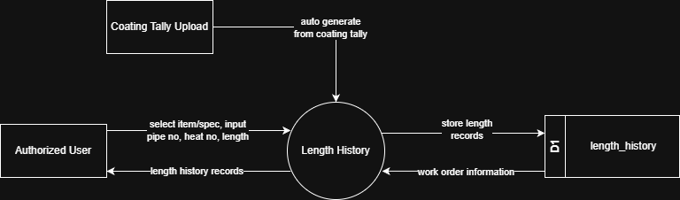

# 7.4.3 Length History Tracking - Data Flow Diagram

This document illustrates the data flow for Length History Tracking operations in the Tubestream system, showing how users record individual pipe production data with heat numbers, pipe numbers, lengths, and photo attachments. Length history can be created manually via form submission or automatically generated from coating tally uploads.

---

## 7.4.3.1 Length History Tracking - Data Flow Diagram Level 0

This image represents a Level 0 Data Flow Diagram (DFD) for the main process of Length History Tracking in Tubestream Pipeline. It outlines the key interactions between users and the system, showing how data flows between entities and the length history tracking process.

*Figure: Length History Tracking - Data Flow Diagram Level 0*

This diagram represents the Length History Tracking process, which manages individual pipe production records for coating processes. Length history can be created through two methods:

1. **Manual Entry**: An Authorized User selects item/spec and inputs pipe number, heat number, and length measurement. The system stores the length record in the length_history data store (D1) and returns length history records to the user for viewing.

2. **Auto-Generation**: When Coating Tally Upload occurs (production tally files uploaded with tally_type containing 'production'), the system automatically generates length history records from the coating tally data with status "unresolved". Each tally record in the tally_list collection creates a corresponding length_history entry.

The Length History process retrieves work order information from the length_history data store (D1) to display records organized by manufacturer and work order. This process supports production tracking and quality assurance by ensuring all individual pipe records are properly documented with measurements, organized by manufacturer and work order, and accessible for project stakeholders to track coating progress throughout the manufacturing lifecycle.

---
