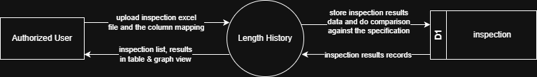

# 7.4.4 Inspection - Data Flow Diagram

This document illustrates the data flow for Inspection operations in the Tubestream system, showing how users upload inspection data via Excel files, process inspection records, and view inspection results.

---

## 7.4.4.1 Inspection - Data Flow Diagram Level 0

This image represents a Level 0 Data Flow Diagram (DFD) for the main process of Inspection in Tubestream Pipeline. It outlines the key interactions between users and the system, showing how data flows between entities and the inspection process.

*Figure: Inspection - Data Flow Diagram Level 0*

This diagram represents the Inspection process, which manages inspection data uploads and reporting for work orders. An Authorized User uploads inspection Excel file and provides the column mapping to define which columns contain inspection data. The system stores inspection results data in the inspection data store (D1) and performs comparison against the specification to validate test results.

The Inspection process retrieves inspection results records from the inspection data store (D1) and returns inspection list and results to the user in table and graph view formats. This process supports quality control by ensuring all inspection data is properly documented with test results, validated against specifications, and accessible for project stakeholders to track quality compliance throughout the manufacturing lifecycle.

---
