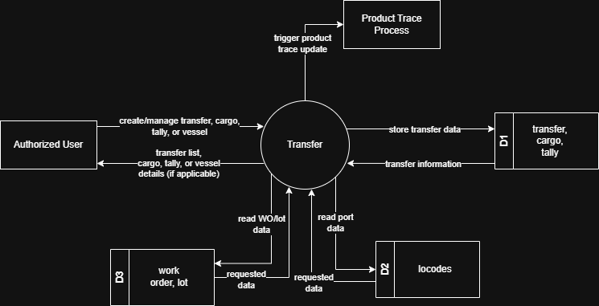
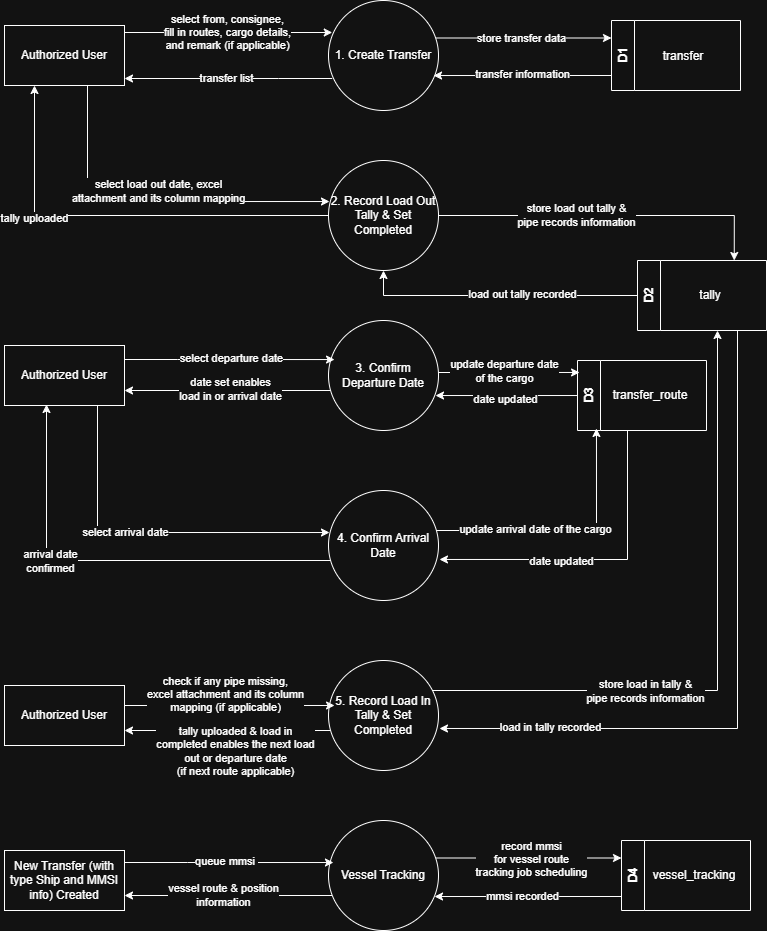

# 7.5 Transfer Module - Data Flow Diagram

This document illustrates the data flow for Transfer Management operations in the Tubestream Pipeline system, showing how users interact with transfer requests, cargo tracking, tally sheets, vessel tracking, and shipment management processes.

---

## 7.5.1 Transfer Module - Data Flow Diagram Level 0

This image represents a Level 0 Data Flow Diagram (DFD) for the main process of Transfer Management in Tubestream Pipeline. It outlines the key interactions between users and the system, showing how data flows between entities and the Transfer Management process.

*Figure: Transfer Module - Data Flow Diagram Level 0*

This diagram illustrates the Transfer Management process in Tubestream Pipeline, showing how data flows between authorized users and the system. The process begins when **Authorized Users** create or manage transfer, cargo, and tally information. The system processes this data in the Transfer module by reading work order data from the work_order data store (D2) and reading port data from the locodes data store (D3).

The system stores transfer data (transfer records, cargo details, tally sheets) in the transfer, cargo, tally data store (D1) and provides transfer information back to authorized users through the transfer list, cargo details, and tally details views. When tally is completed, the system triggers the **Product Trace Process** to regenerate product trace data reflecting new pipe locations and transfer history.

This process supports proper shipment tracking by managing the complete transfer lifecycle (Scheduled → In Progress → Completed), integrating with UN/LOCODE port data for accurate location tracking, linking cargo to work order lots for traceability, recording tally sheets for loading/unloading verification, triggering product trace updates when there's any changes in tally, and maintaining comprehensive transfer, cargo, and vessel information accessible through the transfer database.

---

## 7.5.2 Transfer Module - Data Flow Diagram Level 1

This Data Flow Diagram (DFD) level 1 visualizes the Transfer Management process in Tubestream Pipeline, depicting the flow of data between users, processes, and databases. It offers a more detailed view compared to the Level 0 diagram above. The image below presents the DFD for Tubestream Pipeline's Transfer Management process.

*Figure: Transfer Module - Data Flow Diagram Level 1*

The key components are explained in the table below.

**Table: Transfer Module - Data Flow Diagram Level 1 Key Components**

| No. | User | Input | Process | Output |
|-----|------|-------|---------|--------|
| 1 | Authorized Users | Work order selection, source/destination ports (UN/LOCODE), vessel info (name, MMSI), consignee info, routes with ETD/ETA, cargo details | Create Transfer | Transfer record with "schedule" status, cargo records initialized, transfer routes, vessel tracking queue in transfer, cargo, vessel_queue (D1) |
| 2 | Authorized Users | Tally file upload (Excel), pipe-by-pipe data (pipe numbers, heat numbers, lot numbers, lengths, conditions) | Record Load Out Tally & Set Completed | Tally records saved (load_out type), cargo quantities updated, completed tally flag set, product trace update triggered in tally_list, cargo (D1) |
| 3 | Authorized Users | Actual departure date (ATD) | Confirm Departure Date | Route ATD updated, cargo loadout_atd updated (if first route) in transfer_route, cargo (D1) |
| 4 | Authorized Users | Actual arrival date (ATA) | Confirm Arrival Date | Route ATA updated in transfer_route (D1) |
| 5 | Authorized Users | Tally file upload (Excel), pipe-by-pipe data (pipe numbers, heat numbers, length, etc) | Record Load In Tally & Set Completed | Tally records saved (load_in type), cargo received quantities updated, completed tally flag set, product trace update and adjust overalls triggered in tally_list, cargo (D1) |
| 6 | Automated System (cron job) | MMSI numbers from queue | Vessel Tracking | Vessel position, schedule, remaining time, status updated in vessel_tracking (D1), queue status updated in vessel_queue (D1) |

---

## Code References

**Backend:**
- `app/Http/Controllers/Api/Projects/TransferController.php`
- `app/Services/Projects/TransferService.php`
- `app/Services/Projects/CargoService.php`
- `app/Services/Projects/TallyService.php`
- `app/Repositories/Projects/Transfer/TransferRepository.php`

**Frontend:**
- `resources/js/components/project/transfer/TransferComponent.vue`
- `resources/js/components/project/transfer/CargoDetailsComponent.vue`
- `resources/js/components/project/transfer/TallySheetComponent.vue`
- `resources/js/store/modules/projects/transfer/actions.js`

---

**Status**: ✅ Verified against codebase implementation
