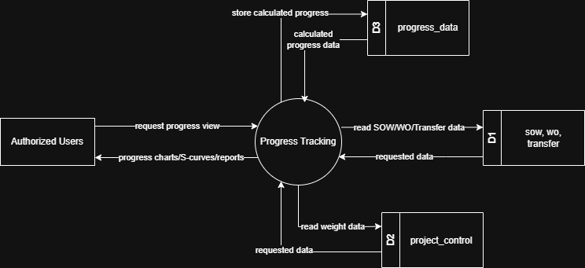

# 7.6 Progress Module - Data Flow Diagram

This document illustrates the data flow for Progress Tracking operations in the Tubestream system, showing how users view calculated progress data through charts, S-curves, and reports.

---

## 7.6.1 Progress Module - Data Flow Diagram Level 0

This image represents a Level 0 Data Flow Diagram (DFD) for the main process of Progress Tracking in Tubestream. It outlines the key interactions between users and the system, showing how data flows between entities and the Progress Tracking process.

*Figure: Progress Module - Data Flow Diagram Level 0*

This diagram illustrates the Progress Tracking process in Tubestream Pipeline, showing how data flows between authorized users and the system. The process begins when **Authorized Users** request progress views. The system processes this request in the Progress Tracking module by reading SOW, Work Order, and Transfer data from the sow, wo, transfer data store (D1) and reading weight configuration from the project_control data store (D3).

The system calculates progress based on configured weights and stores the calculated progress in the progress_data data store (D2). The system then provides progress charts, S-curves, and reports back to authorized users, showing project status and completion percentages.

This process supports accurate project monitoring by automatically calculating progress and applying configured weight distributions from Project Control settings, aggregating progress across manufacturing, coating, and transfer stages, storing calculated progress for historical tracking, and providing real-time progress visualization through circle progress charts, S-curves, and report.

---

## Code References

**Backend:**
- `app/Http/Controllers/Api/Projects/ProgressController.php`
- `app/Services/Projects/ProgressService.php`
- `app/Services/Projects/OverallSOWService.php`
- `app/Repositories/Projects/Inspection/ProgressSOWChartRepository.php`

**Frontend:**
- `resources/js/components/project/progress/ProgressOverallComponent.vue`
- `resources/js/components/project/progress/ProgressChartComponent.vue`
- `resources/js/store/modules/projects/progress/actions.js`

---

**Status**: ✅ Verified against codebase implementation
