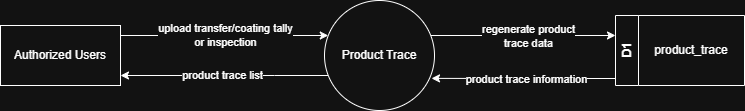

# 7.7.1 Product Trace - Data Flow Diagram

This document illustrates the data flow for Product Trace operations in the Tubestream system, providing complete material traceability from production through delivery. Users can track individual pipes by heat number, pipe number, and view comprehensive inspection results, transfer history, and length history.

---

## 7.7.1.1 Product Trace - Data Flow Diagram Level 0

This image represents a Level 0 Data Flow Diagram (DFD) for the main process of Product Trace in Tubestream Pipeline. It outlines the key interactions between users and the system, showing how data flows between entities and the product trace process.

*Figure: Product Trace - Data Flow Diagram Level 0*

This diagram illustrates the Product Trace process in Tubestream Pipeline, showing how data flows between authorized users and the system. The process begins when **Authorized Users** upload transfer/coating tally or inspection data. The system processes these inputs in the Product Trace module and regenerates product trace data in the product_trace data store (D1).

The system provides product trace information back to authorized users through the product trace list view, showing complete material traceability from production through delivery. Users can track individual pipes by heat number and pipe number, viewing comprehensive inspection results, transfer history, and length history.

This process ensures accurate traceability by automatically regenerating product trace data whenever tally, transfer, or inspection data changes, maintaining synchronized traceability information across all related records (work orders, SOWs, transfers, inspections), and providing complete pipe genealogy for quality control and compliance reporting.

---

## Code References

**Backend:**
- `app/Http/Controllers/Api/Projects/ProductTraceController.php`
- `app/Services/Projects/ProductTraceService.php`

**Frontend:**
- `resources/js/components/project/product-trace/ProductTraceComponent.vue`

---

**Status**: ✅ Verified against Section 5.7.1 Component Design
