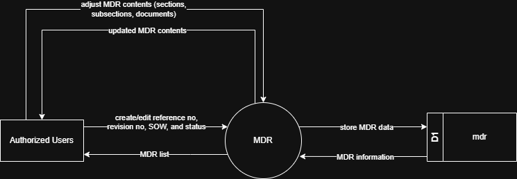

# 7.7.2 MDR (Manufacturing Data Record) - Data Flow Diagram

This document illustrates the data flow for Manufacturing Data Record (MDR) operations in the Tubestream system, showing how users manage manufacturer documents through hierarchical sections and sub-sections with reference numbers and revision tracking.

---

## 7.7.2.1 MDR (Manufacturing Data Record) - Data Flow Diagram Level 0

This image represents a Level 0 Data Flow Diagram (DFD) for the main process of Manufacturing Data Record (MDR) in Tubestream Pipeline. It outlines the key interactions between users and the system, showing how data flows between entities and the MDR process.

*Figure: MDR - Data Flow Diagram Level 0*

This diagram illustrates the Manufacturing Data Record (MDR) process in Tubestream Pipeline, showing how data flows between authorized users and the system. The process begins when **Authorized Users** create or edit MDR records by providing MDR information (reference number, revision number, SOW, and status). The system processes this data in the MDR module and stores the MDR information in the mdr data store (D1).

Users can also adjust MDR contents by managing sections, sub-sections, and uploading documents. The system updates the MDR contents and provides the updated information back to users. The system provides MDR information back to authorized users through the MDR list view, showing document organization and status tracking.

This process supports comprehensive manufacturer document management by organizing documents into hierarchical sections and sub-sections, linking MDRs to related SOWs for traceability, tracking reference numbers and revisions, supporting document file uploads, and maintaining document status (In Progress/Completed) throughout the project lifecycle.

---

## Code References

**Backend:**
- `app/Http/Controllers/Api/Projects/MDRController.php`
- `app/Services/Projects/MDRService.php`

**Frontend:**
- `resources/js/components/project/mdr/MDRComponent.vue`

---

**Status**: ✅ Verified against Section 5.7.3 Component Design
