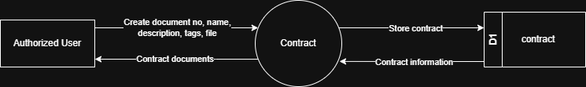

# 7.8.1 Contract - Data Flow Diagram

This document illustrates the data flow for Contract document management operations in the Tubestream system, showing how users upload, organize, and manage contract documents with metadata.

---

## 7.8.1.1 Contract - Data Flow Diagram Level 0

This image represents a Level 0 Data Flow Diagram (DFD) for the main process of Contract document management in Tubestream Pipeline. It outlines the key interactions between users and the system, showing how data flows between entities and the contract process.

*Figure: Contract - Data Flow Diagram Level 0*

This diagram represents the Contract process, which manages contract documents and metadata. An Authorized User creates a new contract entry by providing document number, document name, description, tags, and attached file. The system processes this data in the Contract module and stores the information in the contract data store (D1).

Once stored, the system can generate and return contract documents to the user, making them available for viewing and download. This process supports contract management by ensuring all contract documents are properly documented, organized with searchable metadata, and accessible for project stakeholders to reference throughout the project lifecycle.

---

## Code References

**Backend:**
- `app/Http/Controllers/Api/Projects/ContractController.php`
- `app/Services/Projects/ContractService.php`

**Frontend:**
- `resources/js/components/project/commercial/ContractComponent.vue`

---

**Status**: ✅ Verified against Section 5.8.1 Component Design
