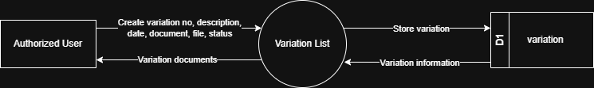

# 7.8.2 Variation List - Data Flow Diagram

This document illustrates the data flow for Variation List operations in the Tubestream system, showing how users upload and manage variation order documents with metadata.

---

## 7.8.2.1 Variation List - Data Flow Diagram Level 0

This image represents a Level 0 Data Flow Diagram (DFD) for the main process of Variation List Management in Tubestream Pipeline. It outlines the key interactions between users and the system, showing how data flows between entities and the variation process.

*Figure: Variation List - Data Flow Diagram Level 0*

This diagram represents the Variation List process, which manages variation order documents and metadata. An Authorized User creates a new variation entry by providing variation number, description, date, document name, attached file, and status. The system processes this data in the Variation module and stores the information in the variation data store (D1).

Once stored, the system can generate and return variation documents to the user, making them available for viewing and download. This process supports variation management by ensuring all contract variations and change orders are properly documented, tracked with status updates, and accessible for project stakeholders to reference for contract modifications.

---

## Code References

**Backend:**
- `app/Http/Controllers/Api/Projects/VariationController.php`
- `app/Services/Projects/VariationService.php`

**Frontend:**
- `resources/js/components/project/commercial/VariationComponent.vue`

---

**Status**: ✅ Verified against Section 5.8.2 Component Design
