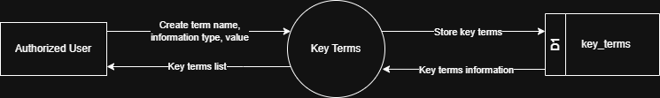

# 7.8.3 Key Terms - Data Flow Diagram

This document illustrates the data flow for Key Terms operations in the Tubestream system, showing how users document important contract terms and conditions with name-value pairs.

---

## 7.8.3.1 Key Terms - Data Flow Diagram Level 0

This image represents a Level 0 Data Flow Diagram (DFD) for the main process of Key Terms Management in Tubestream Pipeline. It outlines the key interactions between users and the system, showing how data flows between entities and the key terms process.

*Figure: Key Terms - Data Flow Diagram Level 0*

This diagram represents the Key Terms process, which manages important contract terms and conditions. An Authorized User creates a new key term entry by providing key term name, information type, and key term value. The system processes this data in the Key Terms module and stores the information in the key_terms data store (D1).

Once stored, the system can generate and return key terms information to the user, making them available for reference. This process supports contract management by ensuring critical contract terms and conditions are properly documented with structured name-value pairs and accessible for project stakeholders to reference throughout the contract lifecycle.

---

## Code References

**Backend:**
- `app/Http/Controllers/Api/Projects/KeyTermsController.php`
- `app/Services/Projects/KeyTermsService.php`

**Frontend:**
- `resources/js/components/project/commercial/KeyTermsComponent.vue`

---

**Status**: ✅ Verified against Section 5.8.3 Component Design
