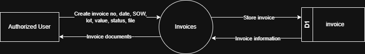

# 7.8.4 Invoices - Data Flow Diagram

This document illustrates the data flow for Invoice operations in the Tubestream system, showing how users manage invoice documents linked to SOW and delivery lots.

---

## 7.8.4.1 Invoices - Data Flow Diagram Level 0

This image represents a Level 0 Data Flow Diagram (DFD) for the main process of Invoice Management in Tubestream Pipeline. It outlines the key interactions between users and the system, showing how data flows between entities and the invoice process.

*Figure: Invoices - Data Flow Diagram Level 0*

This diagram represents the Invoices process, which manages invoice documents linked to project scope and deliveries. An Authorized User creates a new invoice entry by providing invoice number, invoice date, SOW reference, lot number, invoice value, status, and attached file. The system processes this data in the Invoice module and stores the information in the invoice data store (D1).

Once stored, the system can generate and return invoice documents to the user, making them available for viewing and download. This process supports financial management by ensuring all project invoices are properly documented, linked to specific deliveries, tracked with payment status, and accessible for project stakeholders and finance teams to reference throughout the project.

---

## Code References

**Backend:**
- `app/Http/Controllers/Api/Projects/InvoiceController.php`
- `app/Services/Projects/InvoiceService.php`

**Frontend:**
- `resources/js/components/project/commercial/InvoiceComponent.vue`

---

**Status**: ✅ Verified against Section 5.8.4 Component Design
