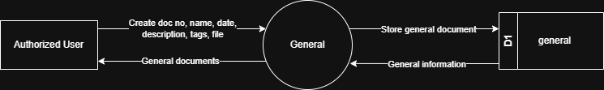

# 7.9.1 General - Data Flow Diagram

This document illustrates the data flow for General documentation operations in the Tubestream system, showing how users upload and manage general documents with metadata.

---

## 7.9.1.1 General - Data Flow Diagram Level 0

This image represents a Level 0 Data Flow Diagram (DFD) for the main process of General documentation in Tubestream Pipeline. It outlines the key interactions between users and the system, showing how data flows between entities and the general documentation process.

*Figure: General - Data Flow Diagram Level 0*

This diagram represents the General process, which manages general documentation and metadata. An Authorized User creates a new general document entry by providing document number, name, date, description, tags, and attached file. The system processes this data in the General module and stores the information in the general data store (D1).

Once stored, the system can generate and return general documents to the user, making them available for viewing and download. This process supports documentation management by ensuring all general project documents are properly documented, organized with searchable metadata (doc number, name, date, description, tags), and accessible for project stakeholders to reference throughout the project lifecycle.

---

## Code References

**Backend:**
- `app/Http/Controllers/Api/Projects/DocumentController.php`
- `app/Services/Projects/DocumentService.php`

**Frontend:**
- `resources/js/components/project/document/DocumentComponent.vue`

---

**Status**: ✅ Verified against Section 5.9.1 Component Design
