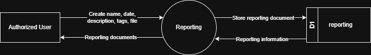

# 7.9.2 Reporting - Data Flow Diagram

This document illustrates the data flow for Reporting documentation operations in the Tubestream system, showing how users upload and manage reporting documents with metadata.

---

## 7.9.2.1 Reporting - Data Flow Diagram Level 0

This image represents a Level 0 Data Flow Diagram (DFD) for the main process of Reporting documentation in Tubestream Pipeline. It outlines the key interactions between users and the system, showing how data flows between entities and the reporting documentation process.

*Figure: Reporting - Data Flow Diagram Level 0*

This diagram represents the Reporting process, which manages reporting documentation and metadata. An Authorized User creates a new reporting document entry by providing name, date, description, tags, and attached file. The system processes this data in the Reporting module and stores the information in the reporting data store (D1).

Once stored, the system can generate and return reporting documents to the user, making them available for viewing and download. This process supports reporting documentation by ensuring all project reports are properly documented, organized with searchable metadata (name, date, description, tags), and accessible for project stakeholders to reference throughout the project lifecycle.

---

## Code References

**Backend:**
- `app/Http/Controllers/Api/Projects/ReportController.php`
- `app/Services/Projects/ReportService.php`

**Frontend:**
- `resources/js/components/project/report/ReportComponent.vue`

---

**Status**: ✅ Verified against Section 5.9.2 Component Design
