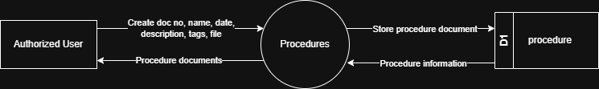

# 7.9.3 Procedures - Data Flow Diagram

This document illustrates the data flow for Procedure documentation operations in the Tubestream system, showing how users upload and manage procedure documents with metadata.

---

## 7.9.3.1 Procedures - Data Flow Diagram Level 0

This image represents a Level 0 Data Flow Diagram (DFD) for the main process of Procedure documentation in Tubestream Pipeline. It outlines the key interactions between users and the system, showing how data flows between entities and the procedure documentation process.

*Figure: Procedures - Data Flow Diagram Level 0*

This diagram represents the Procedures process, which manages procedure documentation and metadata. An Authorized User creates a new procedure document entry by providing document number, name, date, description, tags, and attached file. The system processes this data in the Procedure module and stores the information in the procedure data store (D1).

Once stored, the system can generate and return procedure documents to the user, making them available for viewing and download. This process supports procedure documentation by ensuring all work instructions and standard operating procedures are properly documented, organized with searchable metadata (doc number, name, date, description, tags), and accessible for project stakeholders to reference throughout the project lifecycle.

---

## Code References

**Backend:**
- `app/Http/Controllers/Api/Projects/ProcedureController.php`
- `app/Services/Projects/ProcedureService.php`

**Frontend:**
- `resources/js/components/project/procedure/ProcedureComponent.vue`

---

**Status**: ✅ Verified against Section 5.9.3 Component Design
