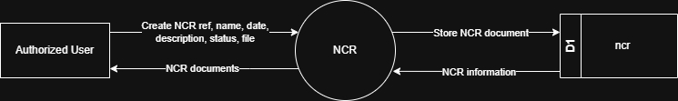

# 7.9.4 NCR (Non-Conformance Report) - Data Flow Diagram

This document illustrates the data flow for Non-Conformance Report (NCR) documentation operations in the Tubestream system, showing how users upload and manage NCR documents with metadata.

---

## 7.9.4.1 NCR (Non-Conformance Report) - Data Flow Diagram Level 0

This image represents a Level 0 Data Flow Diagram (DFD) for the main process of NCR documentation in Tubestream Pipeline. It outlines the key interactions between users and the system, showing how data flows between entities and the NCR documentation process.

*Figure: NCR - Data Flow Diagram Level 0*

This diagram represents the NCR process, which manages non-conformance report documentation and metadata. An Authorized User creates a new NCR document entry by providing NCR reference number, document name, date, description, status, and attached file. The system processes this data in the NCR module and stores the information in the ncr data store (D1).

Once stored, the system can generate and return NCR documents to the user, making them available for viewing and download. This process supports quality documentation by ensuring all non-conformance reports are properly documented, tracked with status updates, organized with searchable metadata (NCR ref, name, date, description, status), and accessible for project stakeholders to reference for quality issues and corrective actions.

---

## Code References

**Backend:**
- `app/Http/Controllers/Api/Projects/NCRController.php`
- `app/Services/Projects/NCRService.php`

**Frontend:**
- `resources/js/components/project/ncr/NCRComponent.vue`

---

**Status**: ✅ Verified against Section 5.9.4 Component Design
